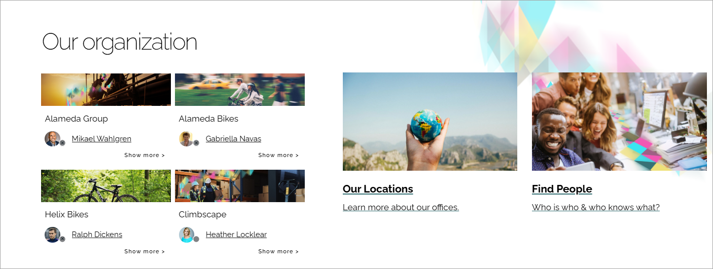
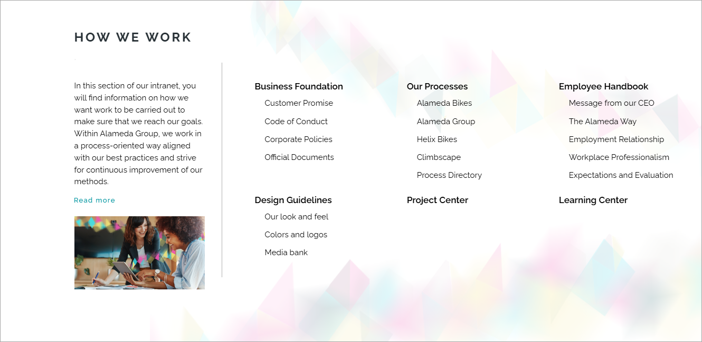
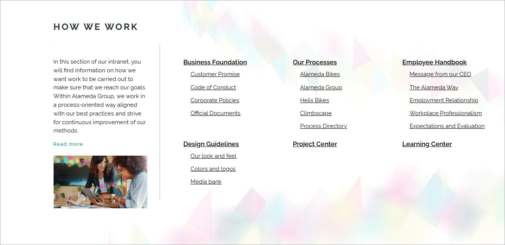
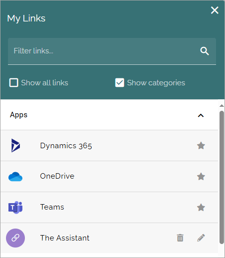

Accessibility
===========================================

**This page is being edited.**

Omnia is WCAG 2.1aa compliant. Administrators can use the features and options in Omnia to set up look and feel, and add content in different ways, to achive the intended level of accessibility:

+ Text alternatives: Using the options in Omnia, editors can provide text alternatives for non-text content, such as images, so it can be changed into other forms people need, like large print, braille, speech, symbols, or simpler language.
+ Time-based Media: Options to add captions for images and videos are always available. Text alternatives for image or video content can easily be added.
+ Variations: Content can be presented in alternative ways, if needed, for example in different languages, in simpler language, or without using images and video.
+ Distinguishable: To make it easier for users to see and hear content, administrators can use the accessibility theme, see below. Using variations, editors can create alternative pages with spoken text, if needed.
+ Keyboard accessible: All functionality is available from a keyboard.
+ Enough time: Using the options in Omnia, editors can see to that users have enough time to read and use content.
+ Seizures and physical reactions: Using the options available in Omnia, editors can design content in a way that do not cause seizures or physical reactions.
+ Navigable: Using available options in Omnia, administrators and editors can set up easy use to use navigation. Omnia also contains a number of search capabilities, that are both powerful and easy to use. 
+ Readable: Omnia contains AI functionality to support editors in the process of adding text content that is both readable and understandable.
+ Predictable: Using page templates in Omnia, editors can see to that pages appear and operate in predictable ways.
+ Input assistance: Omnia contains AI functionality that can help users avoid mistakes when creating text and images.
+ Compatibility: All features in Omnia are developed with compatibility in mind.

The accessibility theme
**************************
Most accessibility features are available from start. Regarding the accessibility theme, administrator can set up and edit this theme as needed. A user can decide to turn this theme on at any time. 

It's up to each user to do that in the User profile menu:

.. image:: accessability-profile.png

Select "Use accessibility features".

.. image:: accessability-profile-select.png

When accessibilty is activated, the accessibility theme is used for pages. It's up to administrators of a specific, customer implementation, to set up look and feel in a way that high accessibility is achieved. 

Here's an example for the breadcrump.

Accessibility not turned on:

.. image:: access-not.png

Accessibility turned on:

.. image:: access-on.png

It's a small but important difference.

In Omnia admin, theme mappings can be set up between the "accessibility theme" and other themes, if needed. That option can be used by a business profile administrator and is found here, for a business profile:

.. image:: admin-access-settings-menu.png

Here's an example of a mapping:
   
.. image:: admin-access-settings-settings.png

Underscore for some links
***************************
Links, where it's not obvious that they are just links, are marked with underscore.

Here's an example where underscore is added to show that this is a link. In certain lists, you can click a colleagues name to open the profile card. When Accessibility features are NOT activated, there's no underscore:

But when Accessibility features ARE active, this page is shown with the names underscored:

When it comes to navigation, underscore is usually added when accessibility features are activated. Here's an example WITHOUT accessibility features:

And this is WITH accessibility features:

Some links are already marked with underscore, mainly links in areas where content is edited by the RTF Editor, so there is no difference either accessibility features are on or not.

In other places it's deemed obvious that links are links, even without the underscore, for example in the Quick links block.

Meaning it looks the same accessibility features on or off.

Sticky tool tips
*****************
The sticky tooltips functionality is being updated and expanded in Omnia. Information about how this works will be added to this page, when a new Omnia version is implemented.

