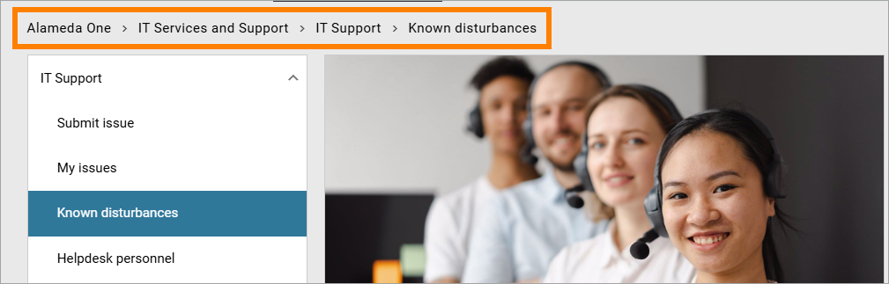
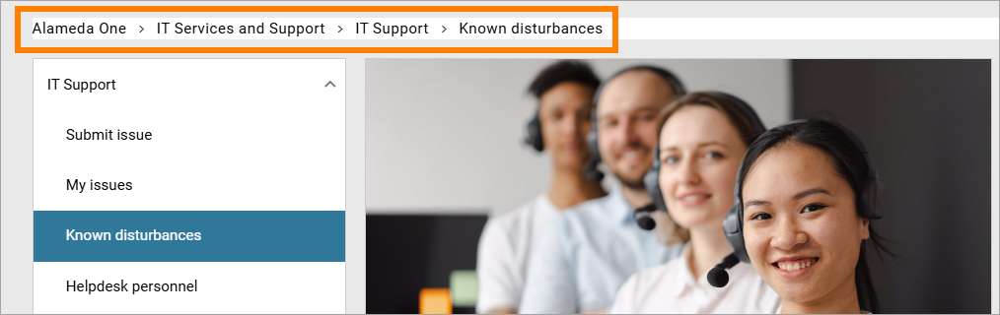
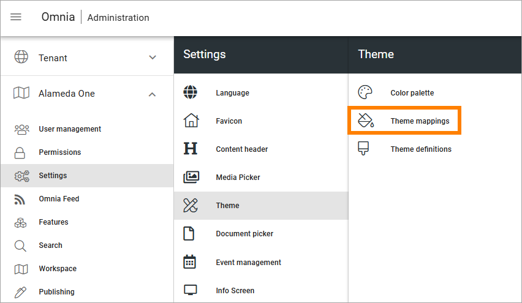
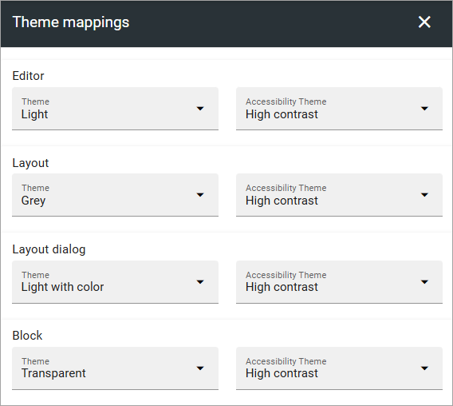
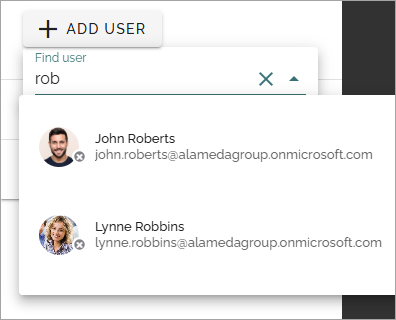
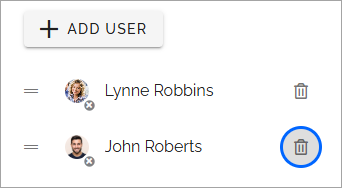

Accessibility
===========================================

Omnia is WCAG 2.1aa compliant. It's up to administrators of a specific, customer implementation, to use the options in Omnia in a way that high accessibility is achieved. Omnia offers a broad "smorgasboard" of features and options suitable for that purpose, for example:

+ Easy to navigate: Using available options in Omnia, administrators and editors can set up easy to use navigation. 
+ Easy to find what users are looking for: Omnia contains a number of search capabilities, that are both powerful and easy to use. One example is semantic search which, if implemented, offers the possibility to search in a much more natural way.
+ Navigate using the keyboard: All functionality is available from a keyboard.
+ Links: All text links are marked with underscore when the accessibility theme is active.
+ Accessibility theme: To make it easier for users to see and read content, administrators can set up the accessibility theme, see below. 
+ Text alternatives for media: Using the options in Omnia, editors can provide text alternatives for non-text content, such as images and videos, either through captions or text blocks.
+ Content presented in alternative ways: The same content can be presented in alternative ways, if needed, for example in different languages, in simpler language, without using images and video, or by using text recordings. The variaitions functionalty in Omnia is a powerful tool for this purpose.
+ Predictable behaviour: Using page templates in Omnia, administrators and editors can see to that pages appear and operate in predictable ways.
+ Seizures and physical reactions control: Using the themes functionality in Omnia, editors can design content in a consistent way that do not cause seizures or physical reactions.
+ Readable and understandable: Omnia contains AI functionality to support editors in the process of adding text content that is both readable and understandable.
+ Input assistance: Omnia contains AI functionality that can assist users when creating text and images.
+ Compatibility: All features in Omnia are developed with compatibility in mind.

As of Omnia 7.8 and later, Omnia has full screen reader support.  

Activating the accessibility features
**************************************
There are also some specific accessiblity features a user can activate anytime. They are activated in the profile menu:

.. image:: accessability-profile.png

Select "Use accessibility features".

.. image:: accessability-profile-select.png

These are the features activated:

+ The accessibility theme.
+ Keyboard navigation.
+ People picker adaption.

For more details, see below.

Setting up the accessibility theme
**************************************
It's up to administrators of a specific, customer implementation, to set up look and feel for the accessibility theme in a way that high accessibility is achieved. 

Here's an example for the breadcrump.

Accessibility not turned on:

Accessibility turned on:

It's a small but important difference.

In Omnia admin, theme mappings can be set up between the "accessibility theme" and other themes, if needed. That option can be used by a business profile administrator and is found here, for a business profile:

Here's an example of a mapping:
   

Using the keyboard to navigate
**********************************
The keyboard can be used to navigate in any Ommnia implementation, for example this way:

+ Use Tab to step forward in a menu or among the blocks on a page.
+ Use Shift-Tab to step backwards.
+ Use Enter to select an option.
+ Use the Up and Down arrows to scroll contents on a page.
+ Use Esc to close dialogs.

The people picker for accessibility
*************************************
To make it possible to use the people picker with the keyboard, a special version is used when accessibility features are on.

Here's how to use it:

1. Go to the field and start typing to search for a user or group.
2. Use Enter to search.

3. Use the arrows to navigate the list and Enter to select.

To remove a user or a group, tab to select the dust bin and then Enter to remove.

For more information on how picking people or groups work, see the page describing the general people picker: :doc:`Using the people picker </general-assets/using-people-picker/index>`

