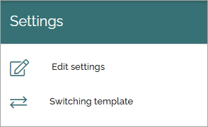

App settings
==============

There are a few settings available on App level (site level). Here's what can be available:

.. image:: app-settings-v7.png

It looks like this in the legacy ui: 

To reach the app settings as described here, you must do the following:

1. Go to the site.
2. Go to Omnia admin.
3. Select the app.

Features
***********
Here you activate, update or remove features for the app, for example:

An example: If your organization is using Document management, you must go here to activate the controlled documents library for sites where working with controlled documents should be possible. If any updates to that features is needed, you go here as well.

+ **Footer**: If you would like the business profile footer, for the active business profile, to be enabled in connected SharePoint sites in this app, select this feature. For more information on the footer settings, see: :doc:`Footer </admin-settings/business-group-settings/workplace/footer/index>`

Descriptions and options 
---------------------------
For a description of a feature, and when using any option like activating, deactivating and updating, expand the feature:

Settings
**********
Under Settings, the following is available:

Edit settings
---------------
Here you can edit the settings for the app, which was set when the app was created. Available settings depend on the template selected for the app.

.. image:: app-settings-settings-edit-v78.png

If you select "Limit view access" you can change view permissions for the app to specific users (as is done in the image above).

Switching template
-------------------
If necessary, you can change to another template for the app here, but the recommendation is that you do that only for apps that are not really used yet.

First select profile and then select template for the profile. (Available templates depend on the profile chosen).

See this page for more information: :doc:`Templates for publishings apps </admin-settings/business-group-settings/publishing-apps/publishing-v7/templates-v7/index>`

