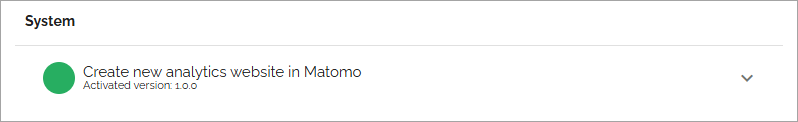

Features (Business Profile)
=============================================

Note that available features can differ depending on how Omnia is set up in your implementration (images from Omnia 7.8).

For a description of a feature, and when using any option like activating, deactivating and updating, expand the feature:

Default configuration
********************************
The purpose of these feature are to provide a number of templates and search profiles for an easy starting point. You can then edit the templates for your organization's needs, and of course add additional templates. 

Media Providers
******************
Here you handle image and video providers - activating, upgrading, removing.

**Note**! In Omnia on-prem, an internet connection must be available both on the server and on the client, for the internet based providers (for example Stream, YouTube, Pexel and Bing) to work. Also note that a separate subscription is needed for Microsoft Stream to be used on-prem.

System
******
Normally just a few features available here, for a business profile, for example (Omnia 7.8):

