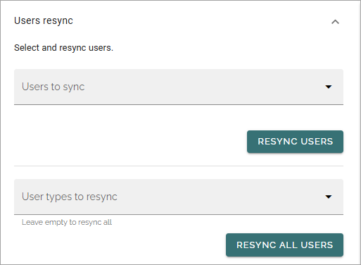
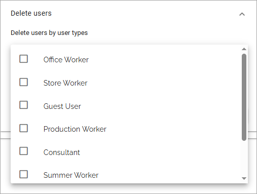

Advanced - Omnia Feed
=============================================

Here you can resync tab content and users, if something has gone wrong. You can also delete users.

Tabs content resync
**********************
This is available here. Read the text thoroughly for details.

.. image:: omnia-feed-resync-711.png

Users resync
**************
You can choose to resync actual users, all users of one or more user types, or even ALL users.

In the top list, just select all specific users to resync and click RESYNC USERS.

**Important note**: This option should be used to resync actual users, not other types of user accounts.

If you want to resync all users, just click RESYNC ALL USERS without any settings. 

To just resync users of some user types, select the types in the list, and then click RESYNC ALL USERS

Delete users
**************.
Use these settings to delete users from Omnia Feed, if needed. 

You can delete all users, all users of one or more user types, or use Excklusion mode to select the user types that should not be deleted.

Delete all users of one or more user types
----------------------------------------------
Here's how:

1. Open the list and select one or more user types.

2. Click DELETE USERS.

Using Exclusion mode
----------------------
Using Exckusion mode is the other way around, you select the user types where users should NOT be deleted.

1. Open the list and select one or more user types.

2. Select "Exclusion mode".
2. Click DELETE USERS.

