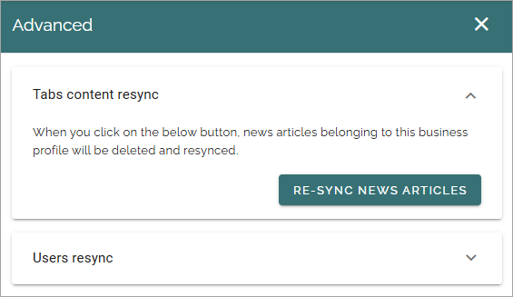
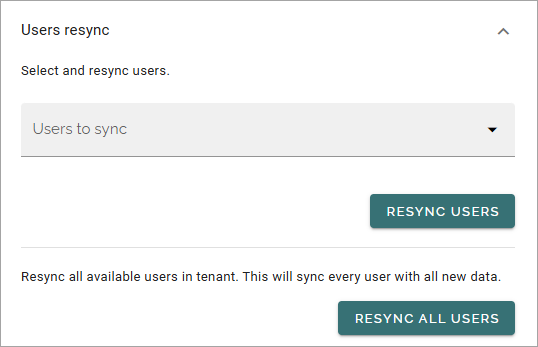

Advanced - Omnia Feed
=============================================

**This description is being edited.**

Here you can resync tab content and users, if someting has gone wrong. You can also delete users.

Tabs content resync
**********************
This is available here. Read the text thoroughly for details.

Users resync
**************
The following settings are available for resyncing users:

If you resync users the initial login to the app is quicker but it's an option, it's not mandatory. Just remember to only resync actual users, not other types of user accounts.

Delete users
**************
