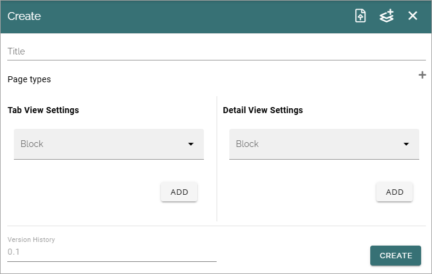
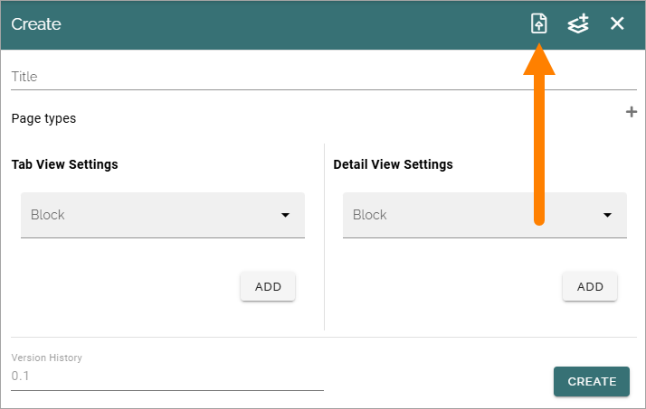
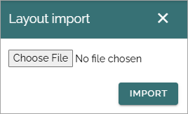
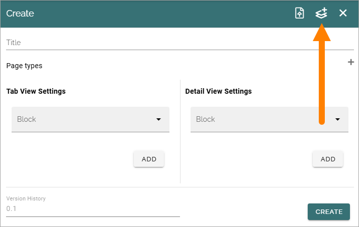
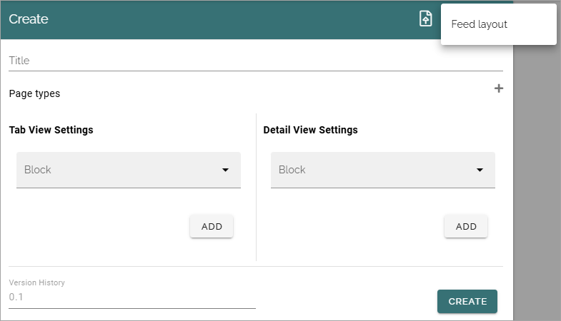

Layout settings
===========================================

**This description is just started. More will be added soon.**

**Note!** Working with layouts for the tabs in Omnia Feed is meant for advanced administrators and developers.

The following settings are available here:

.. image:: layout-settings.png
   
+ **Previewers**: You can choose one or more users as previewers of layouts.

When one or more layouts are created, a list will be shown. For activating layout engine migration, se below.

Creating new layouts
**********************
To create one or more new layouts, click the plus and use the following settings:

You can import a layout or select a layout template as a starting point, see below.

Layout settings
-----------------
Use these settings to create a new layout or edit a template or an imported layout:

+ **Title**: The title will be used in the list of layouts, and as the base for the file name, if the layout is exported.
+ **Page Types**: You can add one or more page types.
+ **Tab view settings**: (A description will be added soon).
+ **Detail view settings**: (A description will be added soon).
+ **Version history**: This is information only.

When all settings are done, don't forget to click CREATE to create the new layout.

Import a layout
****************
If there are layouts that have been exported (migrated), you can import a layout, but note that you must know the file name. Here's how:

1. Click this icon.

2. Click "Choose file" to browse and find the layout file.

3. When you have selected a file, click IMPORT.

Use a template
******************
To use a templateb as a starting point, do the following:

1. Click this icon.

2. Select a layout.

3. When you have selected a file, click IMPORT.

Activate layout engine migration
*********************************
(A description will be added soon).

