Layout settings
===========================================

In Omnia 7.11 and later, there are new options available for layouts, to be used as display settings for page views in Omnia Feed. If you decide to migrate to the new layout engine, the older (legacy) display will be replaced for end users. 

You can set up a number of layouts, to be used with the new layout engine. To speed up the process, you can base a new layout on a template or on an existing (exported) layout file.

**Note!** Working with layouts in Omnia Feed is suitable for advanced administrators and developers. Also, if you plan to continue using the "old" way, the legacy way, of working with the tabs for this business profile, you don't need to do anything here.

You can decide to migrate to the new layout engine, or not, for each business profile.

This is how it works for users:

+ **No migration** (or before migration): previewers can choose to use the legacy display for page views, or choose any of the new layout settings available. Other end users can only see the legacy display.

+ **After migration**: legacy page view display is not available for any user. The new layouts are used.

Available settings also differ when you work with the tab settings. More information is found here: :doc:`Tabs - Omnia Feed </admin-settings/business-group-settings/omnia-feed/tabs-omnia-feed/index>`

The following settings are available for layout settings:

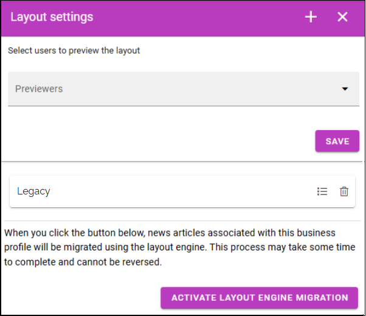
   
This is how you are meant to work with these options:

1. Add one or more previewers, for example if you like some comments along the way. 
2. Create one or more layout drafts. The draft(s) are now listed.
3. Collect comments from the previewers, if any.
4. Do final changes and publish the layouts.
5. Activate the layout engine migration.

**Note!** The layout engine migration can not be reversed for a business profile, once started, as stated in the text above the button. 

After the migration, you can continue working on layouts, as described here.

You can also share layouts between business profiles if you wish, to make sure the tabs look the same for some, or all, business profiles within the tenant - or simply use already created layouts as starting points for new layouts.

Creating new layouts
**********************
To create one or more new layouts, click the plus and use the following settings:

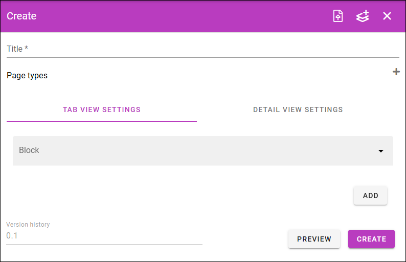

You can import a layout or select a layout template as a starting point, see below. One layout template is always available.

Layout settings
-----------------
Use these settings to create a new layout or edit a template or an imported layout:

+ **Title**: The title will be used in the list of layouts, and as the base for the file name, if the layout is exported.
+ **Page Types**: You can add one or more page types.
+ **Tab view settings**: Here you set up the tab view settings for the tab.
+ **Detail view settings**: Here you set up the detail view setting for the tab.
+ **Version history**: Each time you edit a layout and save or publish it, a new version is created. Published editions are noted with an integer, work in progress with a decimal. When there's more than one version, you can continue working on any version. 
+ **Preview**: Use this button to preview the tab you're working on.

When all settings are done, don't forget to click CREATE to create a draft of the new layout. When the layout is finalized, you can publish the layout.

Edit a layout
*****************
When you have created a layout draft, it's shown in the list and you can edit or delete it. Click here to edit:

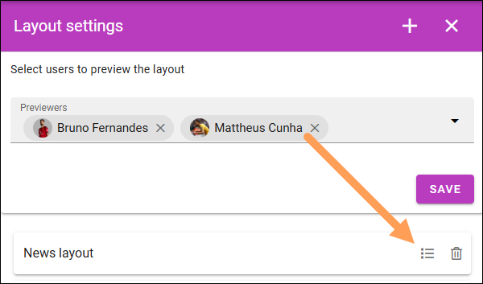

The settings for the layout is shown, for example:

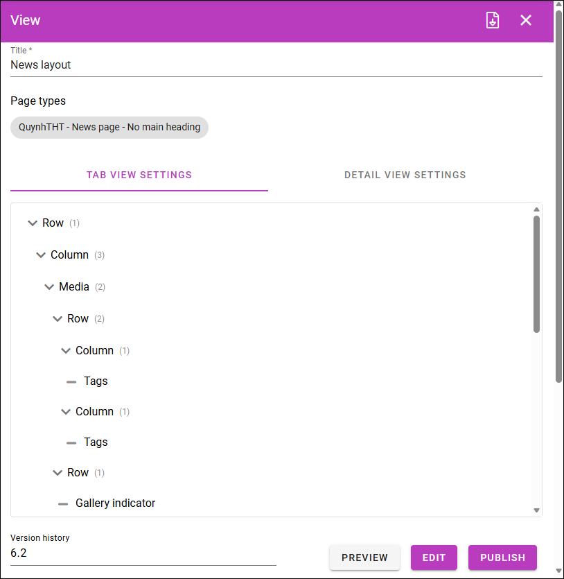

Click EDIT to enter edit mode, which can look someting like this:

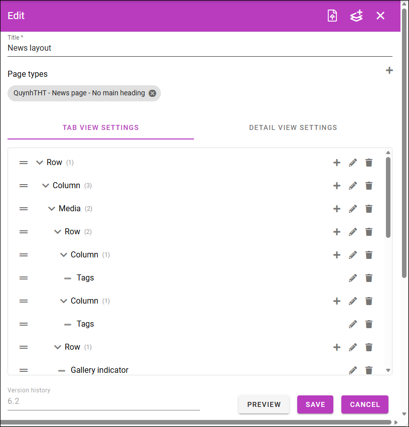

Use the icons to add, edit or delete. You can use the PREVIEW button to check your progress as you're working. 

For several blocks you choose properties the get information from. For most blocks you can also add a custom style sheet if needed, if you know how to use Text style syntax for React Native: https://reactnative.dev/docs/text-style-props

For some blocks, you can select a number of child blocks to be displayed. If it's possible, a plus is shown. Click the plus and add child blocks if needed. If it's not possible to add a child block, the plus is simply not shown.

When all edits are done, and saved, you use the PUBLISH button to finalize the layout.

**Important note**: New blocks can only be added directly when creating a new layout. To add blocks when editing a layout, a container, like Row or Column, must first be added, and then a block can be added in the container.

Create a draft from a published version
*****************************************
When you have opened a published version of a layout, you can create a new draft from that layout:

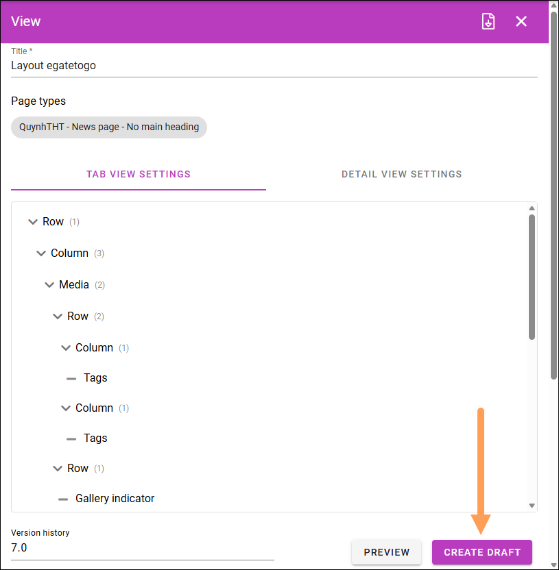

When a new draft is created, you work with it as described above.

Export a layout
*****************
You can export a published layout so it can be used as a starting point, or as is, in another business profile.

Click this button to export the layout:

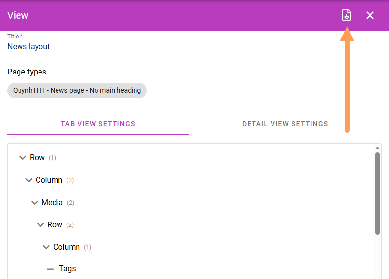

A file is now created as a json file in your computer's Downloads folder, using the title of the layout as the file name. This file can be copied or moved anywhere you need.

Import a layout
****************
If there is a layout that have been exported available, you can import it when you have started working on a new layout, but note that you must know the file name. Here's how:

1. Click this icon.

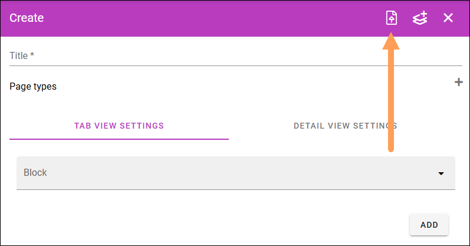

2. Click "Choose file" to browse and find the layout file.

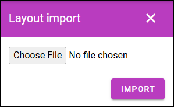

3. When you have selected a file, click IMPORT.

You can now edit the imported layout as you you wish, and publish a new version. Note that the title is not imported, you always have to add a  new title.

Use a template
******************
To use a template as a starting point, do the following:

1. Click this icon.

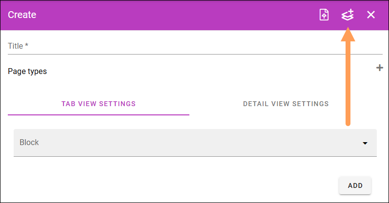

2. Select a layout.

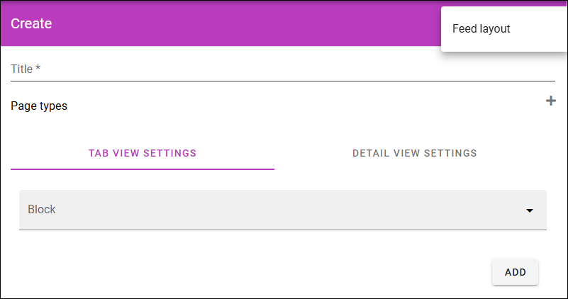

3. Click IMPORT.
4. Edit the template as you wish, and publish a new version.

