Tabs - Omnia Feed
=============================================

**Note!** If you have migrated Omnia Feed to the new layout engine for this business profile (available in Omnia 7.11 and later), there's an important difference, you now select a layout setting for Display, instead of editing detailed settings for tab view or detailed tab view. Other than that, the way you work with the tabs are the same. This documentation will soon be updated with more information about how that works.

Use the settings here to edit tabs for this business profile in Omnia Feed.

Here's an example with a number of tabs set up:

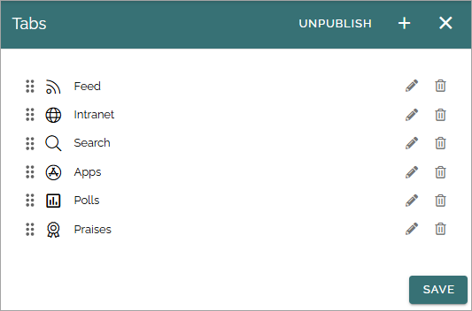

+ **PUBLISH/UNPUBLISH**: Use this to enable/disable this configuration in Omnia Feed. 

To edit settings for one of the existing tabs, click the pen, to delete it, click the dust bin.

All settings used when adding a new tab can be edited, except the tab type, see below.

When any settings for tabs are done, users that already are using the app will be prompted to restart the app. After restart, users will see the changes.

Adding a new tab
******************
To add a new tab, click the plus. Then select the type of tab you want to add.

.. image:: omnia-feed-tabs-select-711.png

Common settings
***********************
For all tabs, these settings are always available:

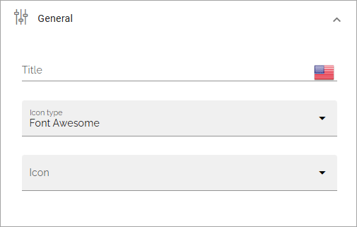

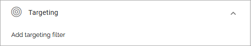

Title, Icon type and Icon can be selected the same way as in many other options in Omnia.

Targeting settings works the same way as in many other parts of Omnia, described here: :doc:`Using targeting </general-assets/targeting-in-omnia/index>`

Multiple query tab
*******************
As the title implies, this tab can be used for multiple queries.

To use one or more queries on this tab, click ADD QUERY, and select query type:

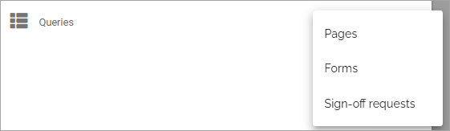

Query type Pages
-----------------
The following settings are available for Pages:

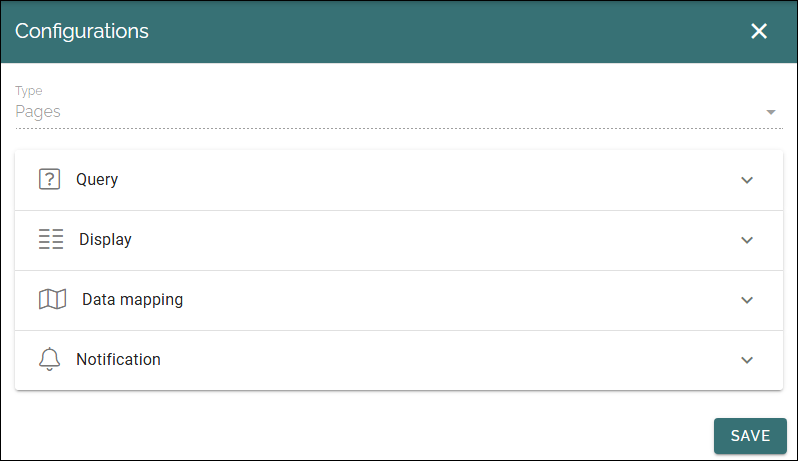

**Query**: For a Pages rollup you can choose one or more page collections, business profiles, publishing apps or the whole tenant. 

When you have added a scope for the rollup, you can select where to get the title from and add filters, for each part of the scope:

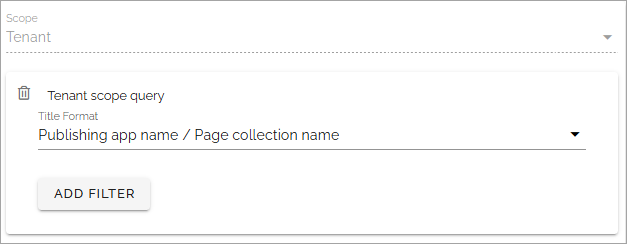

**Display**: Here you can select one or more layouts. 

**Data mapping**: Here you select properties to get certain information from, and at the bottom you can edit settings for sorting.

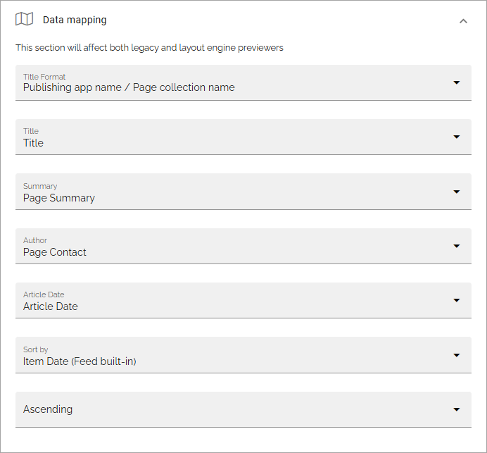

**Notification**: Here you choose if push notifications should be on, and can edit a number of notifications settings. 

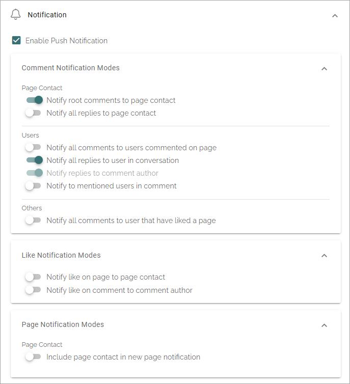

Query type Forms
------------------
For a Forms rollup, the following settings are available: 

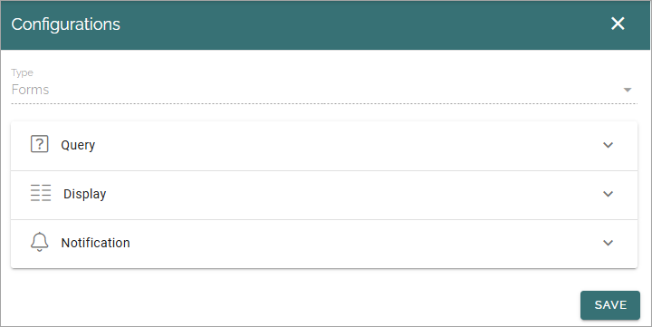

**Query**: You can choose Tenant, one or more business profiles or one or more app instances. You can then add filters for each part of the scope.

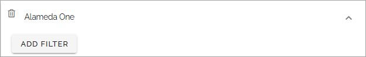

**Display**: Here you can select tags to be diplayed, select properties to get author name and article date from, and add settings for sorting.

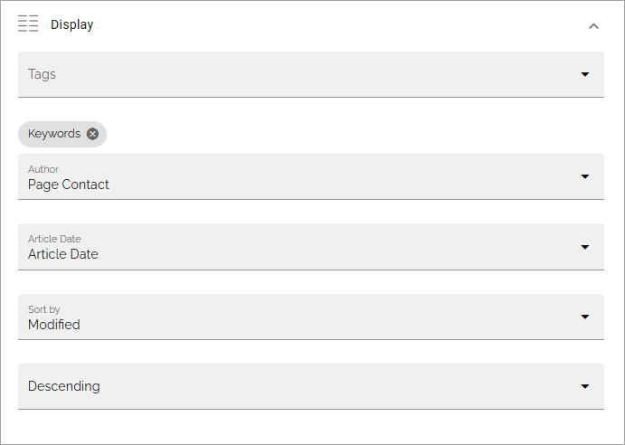

**Notification**: Here you can simply decide if push notifications should be on or off for this rollup.

Query type Sign-off requests
------------------------------
For sign-off requests, the following settings are avaiable:

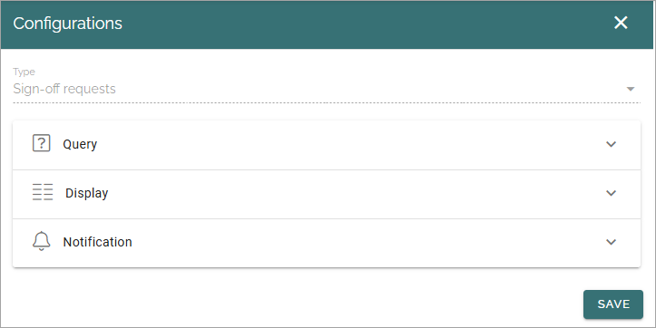

**Query**: You can add filters for the sign-off request you want to list on the tab. Here's an example listing all sign-off requests that is open:

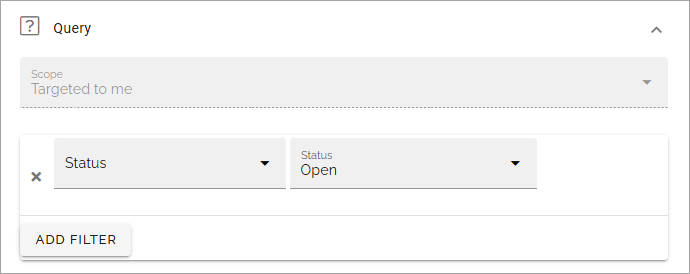

**Display**: Contains only settings for sorting.

**Notification**: You can decide if push notifications should be on or off for this rollup, and set two reminder notifications on or off.

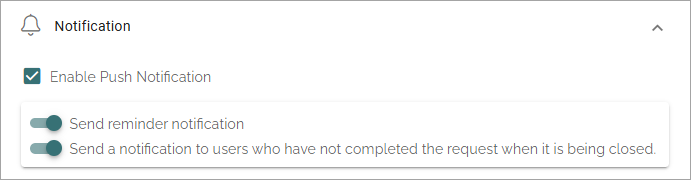

Link tab
**********
For Link tabs, the following settings are available:

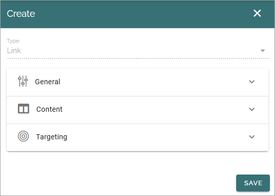

For "General" and "Targeting", general tab settings are available, see above.

Content
-----------
For content, the following is available:

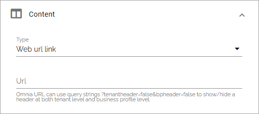

You can choose to use a "Web URL link" or a "Deep link". Then add the link below. A deep link can be used to link to another app, or content in another app, on the users device.

Note the information about Omnia URL links.

Embedded link tab
**********************
For an Embedded link tab, the following settings are available:

General tab settings are available for "General" and "Targeting", see above.

Content
-----------
Add the URL for the embedded link here and select what should be shown as the tab title, the business profle title or the the web page title. You can also hide the header all together. You can alos decide if a navigation button should be shown.

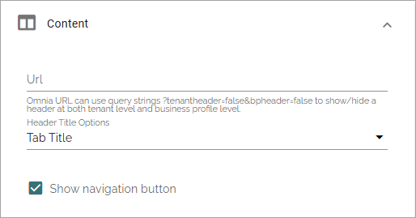

Note the information about Omnia URL:s.

Activity feed tab
**********************
For an Activity feed tab, the following settings are available:

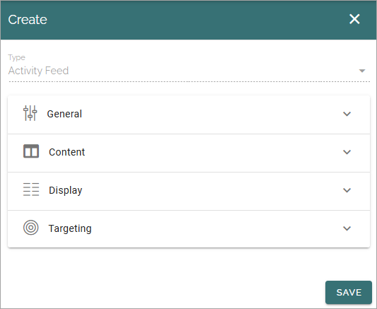

Content
---------
The Activity scope can be from the user's "My subscriptions" or from a "Page collection". 

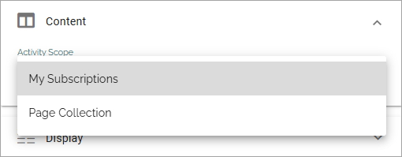

When you choose "My subscription" no further settings are needed. When selecting "Page collection", you must select one or more page collections to get the activity feed from.

Display
---------
For Display, a number of detailed view settings are available.

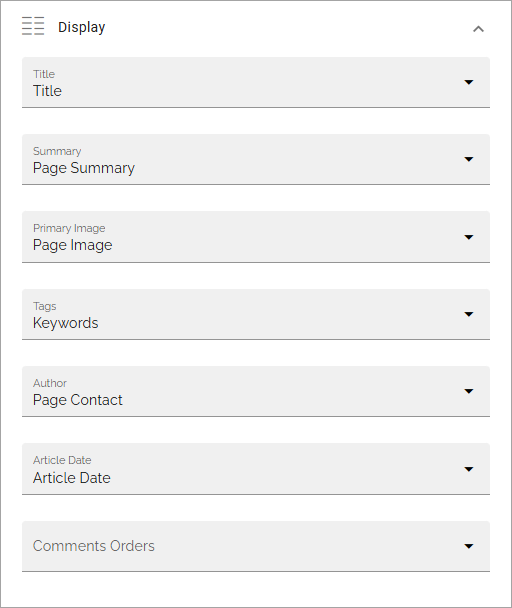

What you do here is to select properties in Omnia that contain the information needed. Note that properties must have been set up in Omnia admin to be available to select here, see: :doc:`Properties </admin-settings/tenant-settings/properties/index>`

As the last option you can choose to order for how comments are shown, "Older To Newer" or "Newer To Older".

