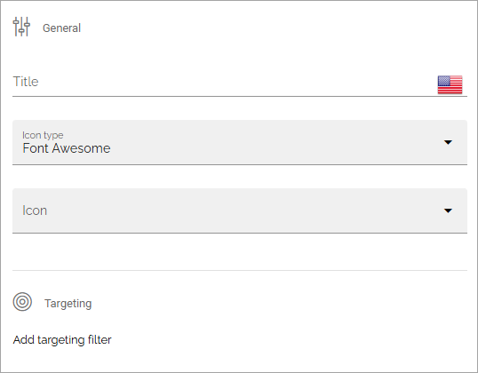
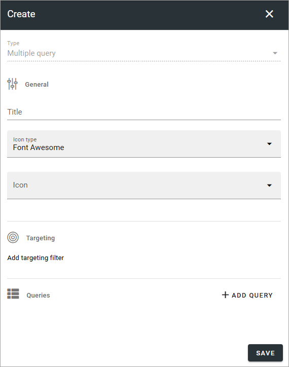
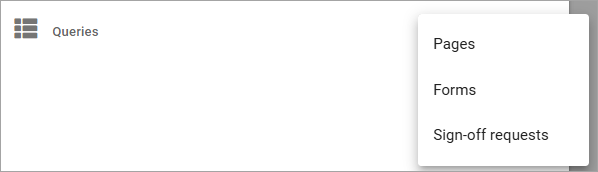
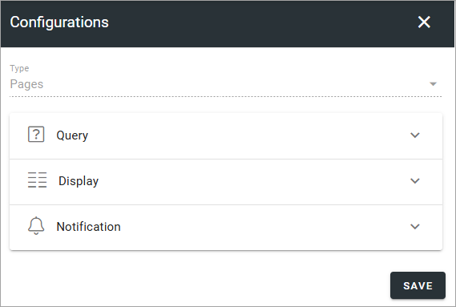
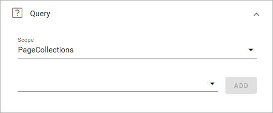
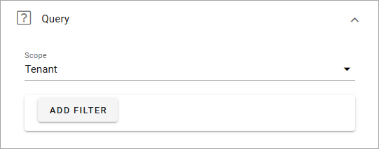
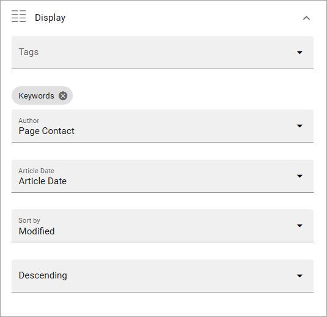
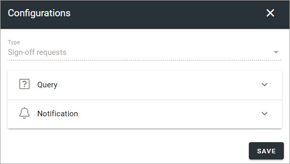
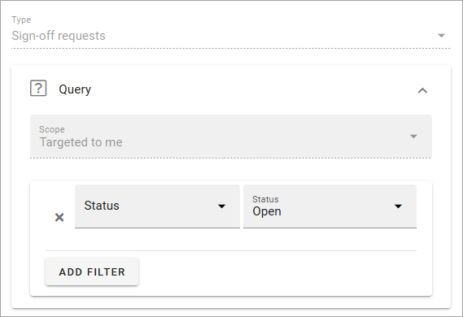

Tabs - Omnia Feed
=============================================

**This desciption is being edited.**

Use the settings here to edit tabs for this business profile in Omnia Feed.

Here's an example with a number of tabs set up:

.. image:: omnia-feed-tabs-v711.png

+ **PUBLISH/UNPUBLISH**: Use this to enable/disable this configuration in Omnia Feed. 

To edit settings for one of the existing tabs, click the pen, to delete it, click the dust bin.

All settings used when adding a new tab can be edited, except the tab type, see below.

When any settings for tabs are done, users that already are using the app will be prompted to restart the app. After restart, users will see the changes.

Adding a new tab
******************
To add a new tab, click the plus. Then select the type of tab you want to add.

.. image:: omnia-feed-tabs-select-711.png

Common settings
***********************
For all tabs, these settings are always available:

+ **Title**: Add a title for the tab.
+ **Icon type**: If you want an icon for the tab, select icon type here.
+ **Icon**: Choose icon from the selected type here. If you leave this field empty, no icon is shown.

Targeting settings works the same way as in many other parts of Omnia, described here: :doc:`Using targeting </general-assets/targeting-in-omnia/index>`

Multiple query tab
*******************
As the title implies, this tab can be used for multiple queries:

For general and targeting settings, see above.

To use one or more queries on this tab, click ADD QUERY, and select query type:

Pages
-------
The following settings are available for Pages:

Query: For a Pages rollup you can choose one or more page collections, business profiles, publishing apps or the whole tenant. And then, in the second list, one or more within the scope.

Display and Notification has the same type of options as for the Query tab, see above.

Forms
----------
For a Forms rollup you can choose Tenant, one or more business profiles or one or more app instances, under Query. You can then add filters the same way as for other rollups.

Display are somewhat different from the oher options:

At the top, you can select tags to be diplayed, the rest you have seen before.

For Notification, you can decide to enable push notification for this rollup, or not.

Sign-off requests
------------------
For sign-off requests, the following settings are avaiable:

For queey, you can add filters for the sign-off request you want to list on the tab. Here's an example listing all sign-off requests that is active:

For Notification, you can decide to enable push notification for this rollup, or not.

Link tab
**********
For Link tabs, the following settings are available:

.. image:: omnia-feed-link-tab-v7.png

For "General" and "Targeting", general tab settings are available, see above.

Content
-----------
For content, the following is available:

.. image:: omnia-feed-link-tab-content-v7.png

You can choose to use a "Web URL link" or a "Deep link". Then add the link below. A deep link can be used to link to another app, or content in another app, on the users device.

Note the information about Omnia URL links.

Embedded link tab
**********************
For an Embedded link tab, the following settings are available:

.. image:: omnia-feed-embedded-v7.png

General tab settings are available for "General" and "Targeting", see above.

Content
-----------
Add the URL for the embedded link here and select what should be shown as the tab title, the business profle title or the the web page title. You can also hide the header all together.

.. image:: omnia-feed-embedded-link-v7.png

Note the information about Omnia URL:s.

Activity feed tab
**********************
For an Activity feed tab, the following settings are available:

.. image:: omnia-feed-activity-feed-v7.png

For "General" and "Targeting", general tab settings are available, see above.

Content
---------
The Activity scope can be from the user's "My subscriptions" or from a "Page collection". 

.. image:: omnia-feed-activity-feed-content-v7.png

When you choose "My subscription" no further settings are needed. When selecting "Page collection", you must select one or more page collections to get the activity feed from.

Display
---------
For Display, a number of detailed view settings are avalable.

.. image:: omnia-feed-activity-feed-display-v7.png

What you do here is to select properties in Omnia that contain the information needed. Note that properties must have been set up in Omnia admin to be available to select here, see: :doc:`Properties </admin-settings/tenant-settings/properties/index>`

As the last option you can choose to order for how comments are shown, "Older To Newer" or "Newer To Older".

