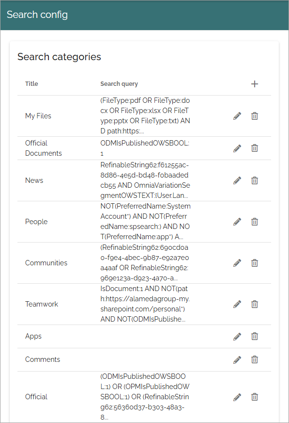
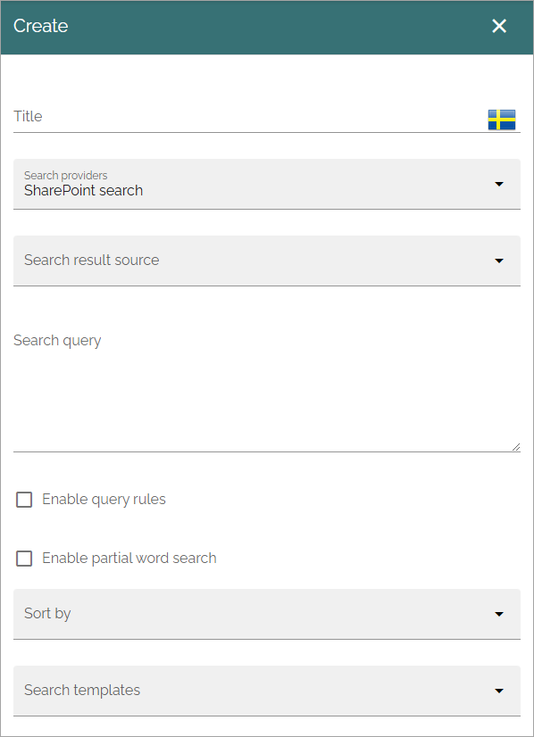
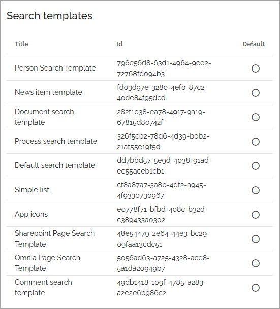

Search config
=======================================

Here you can work with search categories and set default search template. Here's an example of search categories:

To edit a Search config, click the pen. To delete a search config, click the dust bin.

Search categories
*******************
To create a new search category, click the plus and use the settings available for the Search Provider. All settings listed below.

+ **Title**: Add a title for the search category.
+ **Search providers**: Select search provider for the category. The following is available: Comments, Shared links, SharePoint search, Microsoft search, Omnia search and Semantic search. **Note!** In Omnia on-prem only SharePoint search and Shared links can be used as search providers. Semantic search is available in Omnia 7.8 and later.
+ **Search result source**: Select Source from the list.
+ **Search query**: Add the search query here. Tokens can be used for a dynamic search query, see this page: :doc:`Using tokens in Omnia </general-assets/using-tokens-in-omnia/index>`
+ **Enable query rules**: Query rules can be set up in SharePoint. If these query rules should be used for this category, select this option.
+ **Enable partial word search**: Per default the search will onfly find whole words, so a search for Chris will find just that, not for example Christina. But if you select this option, the search will find parts of words as well, so both Chris, Christina and Christian, for example.
+ **Sort by**: Choose property to sort by, or you can choose to sort by Relevance or Popularity (at the bottom of the list).
+ **Sort direction**: When you have chosen a property to sort by, you can select a sort direction here.
+ **Search templates**: Select one or more search templates from the list.
+ **Targeting filter**: A search category can be targeted to a specific group of people based on the targeting system in Omnia. This setting will be used both in quick and advanced search. More information is found here: :doc:`Using targeting </general-assets/targeting-in-omnia/index>`

The same settings are available when editing a search category.

A note on semantic search
----------------------------
Semantic search is available in Omni 7.8 and later. The tenant feature "Semantic search" must be active for this functionality to be available.

**Very important!** The semantic search will soon be developed further in Omnia but for now it does **not support security trimming**. Therefore, use semantic search only for common information that anyone in the organization have permission to read. If semantic search should be used can be set at page collection level for pages, and in document types for controlled documents. Semantic search does not work for other types of documents yet.

Search templates
*********************
Search templates are created by developers and are simply listed here. A search template defines how to display a search result. If a search result happens to not match any search template, the default search template is used. You can set default search template by clicking any of the templates in the list.

In this example there's a search template that is named default, but any other template can be selected.

Image/Icon sizes
******************
(A description will be added soon).

