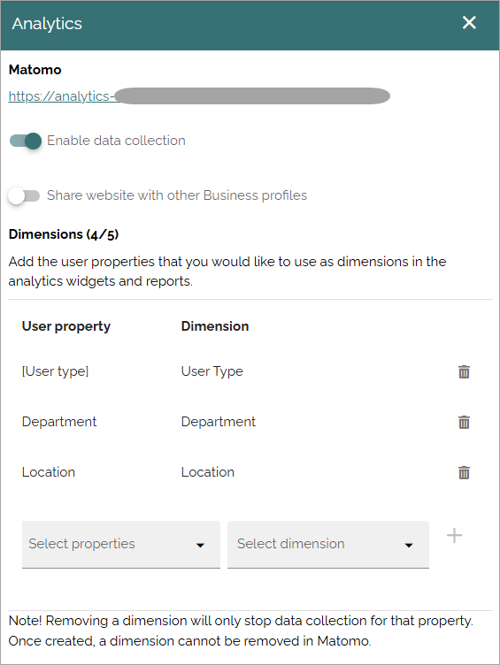
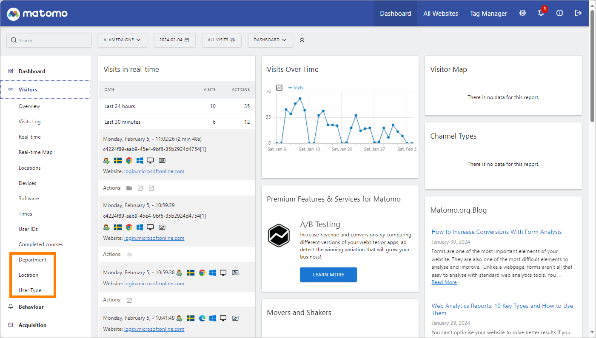

Analytics (Matomo) settings
=============================================

Pre requisite: To use Matomo analytics, the tenant feature "Analytics core setup" must be activated, and for a business profile, the feature "Create new analytics website in Matomo" must be activated. 

Omnia 7.7: No set up at tenant level is required. 

Omnia 7.8: Matomo events tracking can also be set up. Settings is available for page types, form types, documents in document rollups and action buttons.

Omnia 7.7 analytics data is always collected separately for each business profile. 

Omnia 7.8 a Matomo website can be shared between business profiles, meaning data can be collected from more than one business profile, to a shared Matomo web site.

Matomo documentation is fully processed in ChatGPT, so you can use ChatGPT to ask about how to use various parts of Matomo functionality.

**Note!** All users that should have permission to see the analytics data must be added as Analytics readers: Business profil > Permissions > Users and groups > Analytics.

If you need to set up additional geolocation DBIP databases, see this page: :doc:`How to setup additional geolocation DBIP databases </admin-settings/business-group-settings/settings/analytics/set-up-dbip/index>`

These settings are available for Matomo analytics, in a business profile (image from Omnia 7.8):

+ **Matomo**: You can use the link shown here to go to the Matomo analytics page for this business profile.
+ **Enable data collection**: For Matomo analytics to work, this option must be selected. *Very important*: No historic data can be collected so it's important to enable this as early as possible, even before you have set up anyhting else regarding the analytics. See below for more information.
+ **Share website with other business profiles**: Available in Omnia 7.8 and later. To share this Matomo website with other business profiles, select this option. See below for more information.
+ **Dimensions**: Here you decide what segments of analytics data to store for users. See more information below.

Matomo event trackning
-----------------------
When data collection is on in a business profile, navigation data is always collected. In Omnia 7.8 and later, Matomo events tracking can also be used, if needed. Matomo Event trackning can  be set up for pages (settings for each page type), forms (settings for each form type), documents in documents rollup and for action buttons.

For more information about how Matomo event tracking works and the available settings, see: :doc:`About Matomo event tracking </general-assets/about-matomo-event-tracking/index>`

Share analytics with other business profiles
*********************************************
To share analytics data with another business profile, meaning collecting analytics data to a shared Matomo web site, do the following:

1. Select "Share website with other business profile" in the master profile. 

The master profile is the business profile name that is displayed in lists where you select which "web site" to show analytics data from.

2. Go to a business profile you will add, meaning collecting analytics data from that business profile as well.
3. Go to Settings-Analytics in the settings for that business profile.
4. Select "Enable data collection".
5. Select the master profile in the list.

Add and remove dimensions
**************************
To add a dimension, do the following:

1. Select the property.
2. In the dimension list, select "Create dimension". If the dimension is already created, you can map another property to it.
3. Click the plus.

To remove a dimension, just click the dust bin. **Important!** Read the note at the bottom carefully! You can't delete a dimension once it has been set up, but you can rename it.

Here's an example of an analytics page. The dimensions set up in the image above are available here:

For more information about how to use Matomo analytics, see this page: https://matomo.org/help/

Blocks for analytics
***********************
Another alternative for displaying analytics is to use the blocks useful for this purpose (actually used in the example above as well), see:

+ :doc:`Analytics counter </blocks/analytics-counter/index>`
+ :doc:`Analytics filters </blocks/analytics-filters/index>`
+ :doc:`Analytics report </blocks/analytics-table-block/index>`
+ :doc:`Analytics widget </blocks/analytics-widget/index>`
+ :doc:`Metrics </blocks/metrics-block-612/index>`

About Matomo marketplace
***************************
There are a lot of additional plugins, themes and more, that can be purchased/downloaded from Matomo marketplace (see link to Matomo above). If you decide to use any additions, just be aware that Omnia can not guarantee that these additions works as expected in Omnia, and can not offer any support on the additions.

