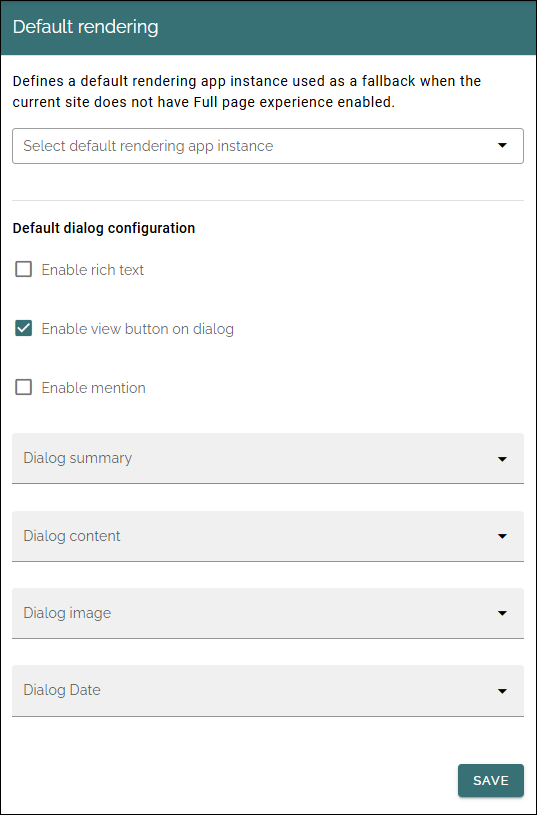

Default rendering
==============================

Avaialable in Omnia 7.12 and later.

As it says, it's fall back settings:

The three settings at the top should be self explanatory. In the lists below you select properties to get dialog summery, dialog content, dialog image and dialog date from.

