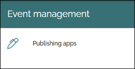
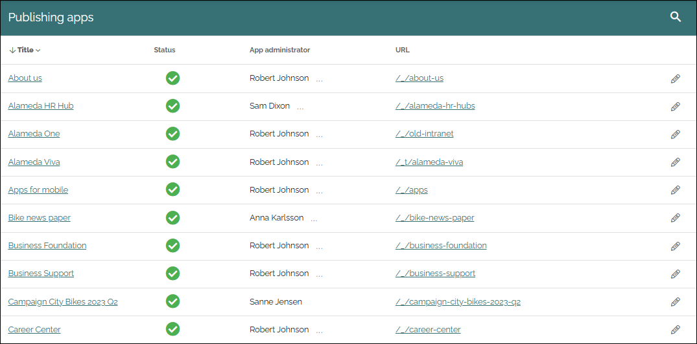
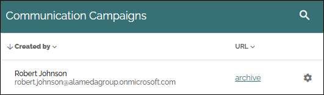
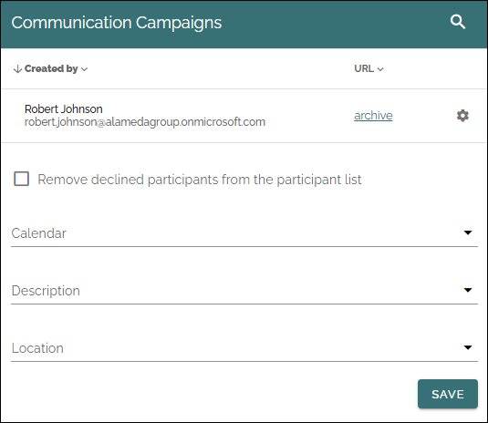

Event management
===================
Here you can select publishing apps in the business profile, to edit settings for event management.

Here's an example of a list of publishing apps:

You can click a link to go to the publishing app, for example to check that if it is the one you plan to edit. You can also search for a publishing app.

To edit settings for event management, click the pen. The page collections in the publishing app is now shown, for example:

You can click a link to go the page collection, for example to check that if it is the one you plan to edit.

To edit event management settings, click the cogwheel for the page collection.

Here's the settings for Event management:

Use them this way:

+ **Remove declined participants from the participant list**: Select this option if declined participants should removed from the participant list automatically.
+ **Calendar**: Select the calendar for event management in this page collection, if your event management setup should be connected to a calendar.
+ **Description**: Select the property to be used for the description of the event, shown in the calenders.
+ **Location** Select the property to be used for the location of the event, shown in the calenders.

Don't forget to save when you're done.

For more information about event management, see: :doc:`Working with events </working-with-events/index>`

