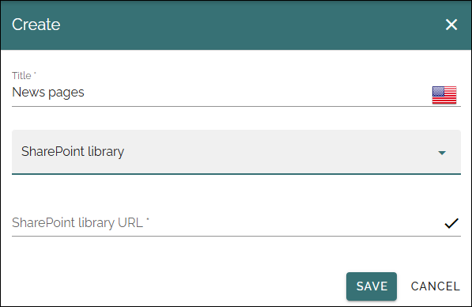
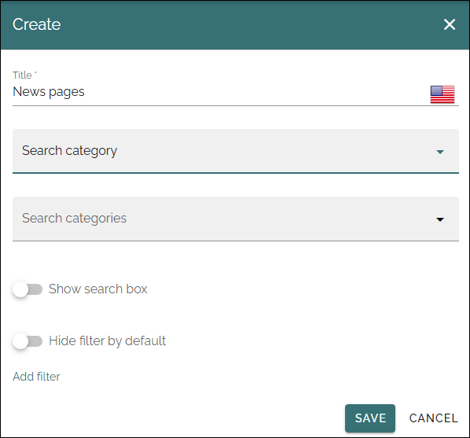
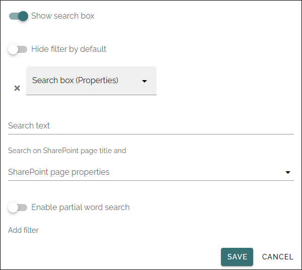

SharePoint page picker settings
=================================

Available in Omnia 7.12 and later.

Links to SharePoint pages can be selected in the Add link picker, if one or more SharePoint page categories are set up here.

These settings are available:

Setting up a library is straight forward, just add the link to the SharePoint library in the field.

To set up a search category as a SharePoint page catagory, use these settings:

+ **Search categories**: If you selected "Search category", use this list to select the category (mandatory). The search categories are set up for the business profile, see: :doc:`Search settings </admin-settings/business-group-settings/search/index>`
+ **Show search box**: For a search category, you can add a search box at the top. When you select this option, you can select what to search on, see below.

If you choose to show a search box, these additional settings are available:

+ **Hide filter per default**: If you select this options, filters are hidden but users can choose to display them. 
+ **Add filter**: If you are using a search category you can add filters to allow the users to filter the list in the page picker.
+ **Search text**: Add a text to be shown in the field before a search is conducted.
+ **Search on page title and**: You can select one or more additional properties to search on here (not mandatory). As stated in the label, a search on page title is always conducted.
+ **Enable partial word search**: Per default the search will only find whole words, but if you select this option, the search will find parts of words as well.
+ **Add filter**: Here you can add one or more filters to be used by end users.

Don't forget to click "Save" when you're finished, to create the document picker category.

