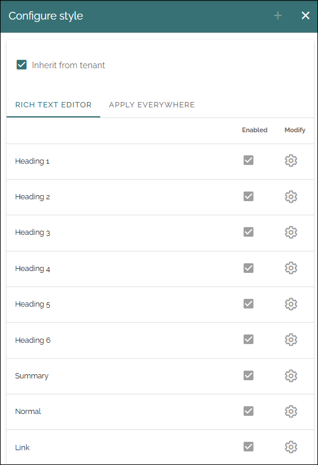
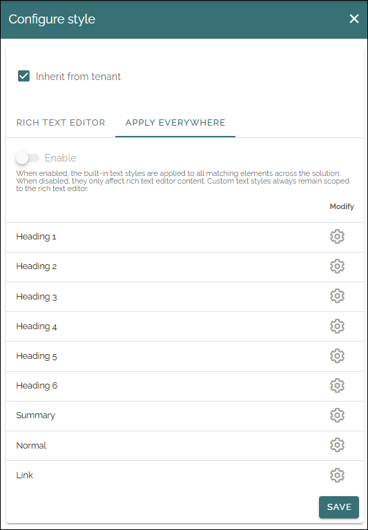

Text styles - Business profile
================================

Here you can choose to inherit text styles from the tenant, or choose the text styles that should be availaböe specifically in this business profile. Available in Omnia 7.12 and later.

You can choose available text styles, and even create new ones if needed, for the RTF editor when used in this business profile, and if some styles should be available everywhere.

(All text styles are not shown in the image).

Rich text editor styles
*************************
You work with the text styles for a business profile exactly the same way as for the tenant, see: :doc:`Text styles - tenant </admin-settings/tenant-settings/settings/text-styles/index>`

Only difference is that the settings you do here, and eventual new styles you create, are applicable in this business profile only.

Apply everywhere
*******************
In Omnia 7.12 and later, you can choose a number of the built-in text styles to be applied to all matching elements across the solution. If you don't enable this, they only affect rich text editor content. Custom text styles always remain scoped to the rich text editor, not matter what you choose here. 

These settings are made for the tenant as well. If you would like to do some other settings for the built in styles for this business profile, start by deselecting "Inherit from tenant". Then use the cogwheel to edit settings. The settings are done exactly the same way as for the tenant, see linke above.

**Important note**: Inherit from tenant is applied for both Rich text editor settings and Appply everwhere settings. You can't choose to inherit one and not the other.

