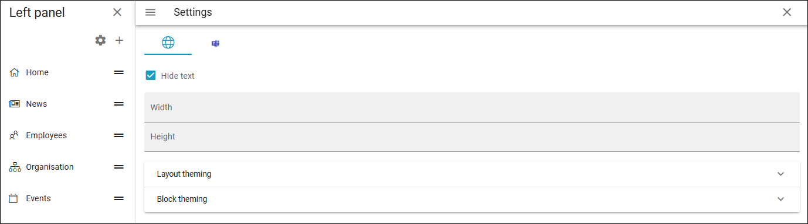

Left panel settings
================================

Available in Omnia 7.12 and later. The app feature "Show navigation bar" must be activated in every app where it will be used, for the panel to be available.

These settings are available:

You work with these settings the same way as with the mega menu settings for the workspace, see this page: :doc:`Navigation bar </admin-settings/business-group-settings/workplace/navigation-bar/index>`

(More information will be added soon.)

