Navigation bar
=================

Here you can edit navigation bar settings for the business profile's workspace. You can add different settings for the default navigation bar and for the navigation bar used in MS Teams. 

You can use several mega menu objects and several action menu objects, if needed.

When working with the layout, you can use all the sections and blocks that normally are available for pages, so the possibilities are almost endless. You can even add different layouts for different screen sizes, if needed, to fit for example both computer and mobile phone.

Home settings
***************
Here you can edit the settings for the link to the workspace home page. 

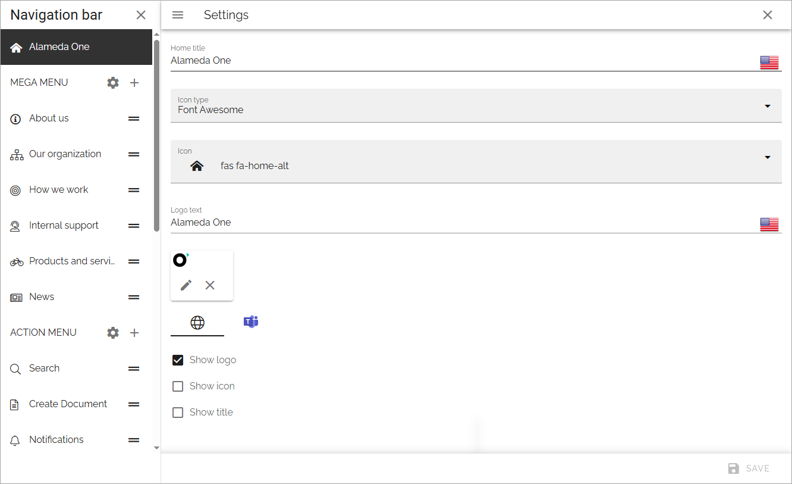

+ **Home title**: If you would like to show a Home title, add it here, in any tenant language. Then select "Show title" below.
+ **Icon type**: To show an icon, select icon type here. If you select "Custom" here, you can upload any image, using the media picker, to use as an icon. (If an icon type is seleted, but no icon is selected, no icon is shown).
+ **Icon**: To show an icon, select icon in the list. Then select "Show icon" below.
+ **Logo text**: If you would like to show a logo text by the home title, add it here, in any tenant language. 
+ **Show logo**: If a logo should be displayed, select this option. Note that you use ADD LOGO to upload the logo, see below.
+ **Show icon**: If an icon should be displayed, either an icon selected in the icon list, or one you have uploaded, select this option.
+ **Show title**: If the Home title should be displayed, select this option.

Note the separate settings for the home page in Microsoft Teams.

To add a Logo, do the following:

1. Click ADD LOGO.
2. Use the media picker to find and select the image.

See this page for more information: :doc:`The media picker </general-assets/media-picker/index>`

Don't forget to save when you're done.

Mega menu settings
************************
To open the Mega menu settings, click the cog wheel:

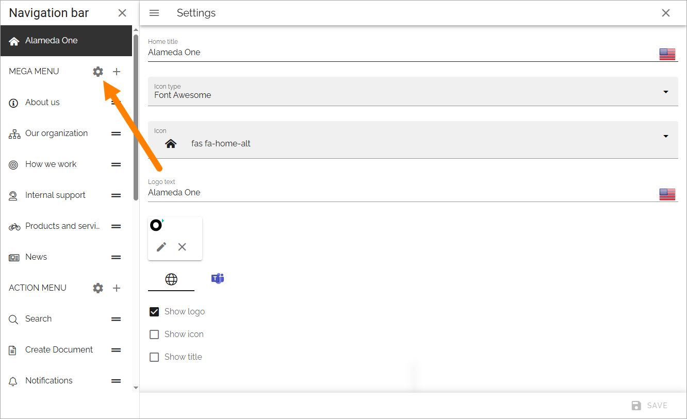

Separate settings are available for the default mega menu, and for the mega menu used in MS Teams.

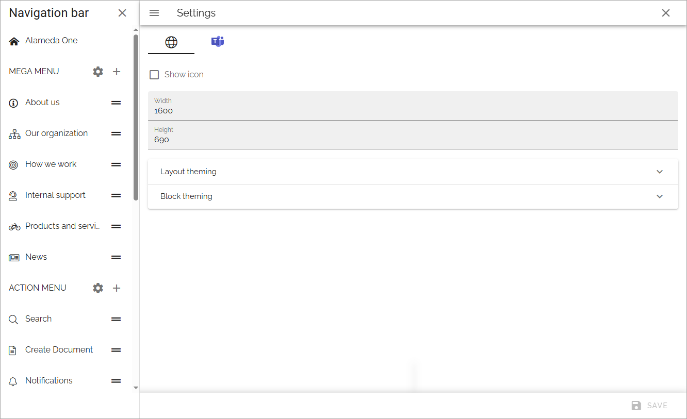

+ **Show icon**: Select to show/hide navigation icons.
+ **Show text**: Select to show/hide mavigation texts.
+ **Max Wwdth**: You can set a maximum width in pixels for the navigation bar, if needed.
+ **Max height**: You can set a maximum height in pixels for the navigation bar, if needed.
+ **Layout theming**: If you would like to use custom settings for the layout, open this section and select "Custom theme". 
+ **Block theming**: If you would like to use custom settings for the layout, open this section and select "Custom theme". 

Layout theming are the same settings as are described here: :doc:`Layout theming </general-assets/layout-explorer/page-layout/layout-theming/index>`

And Block theming has the same settings, but is used for blocks (obviously).

See below for information on how to add mega menu objects.

Action menu settings
**********************
To open the settings for the action menu, click this cog wheel:

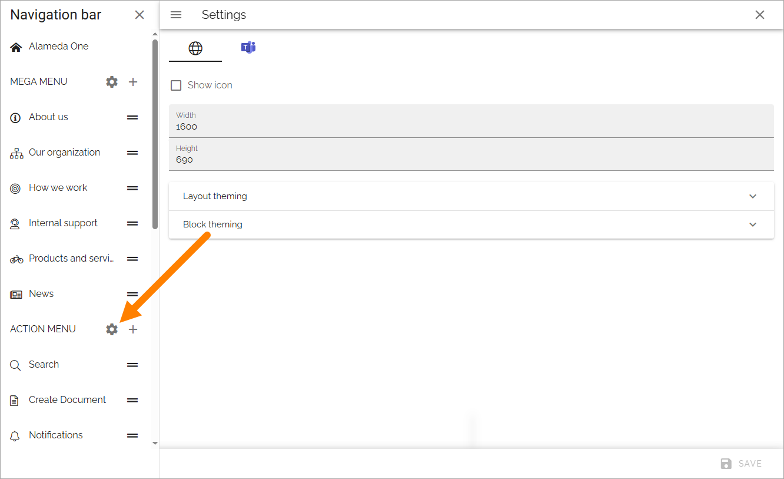

The following settings are available here, for the default action menu and for the action menu used in MS Teams (the action menu in MS Teams is not applicable in Omnia on-prem):

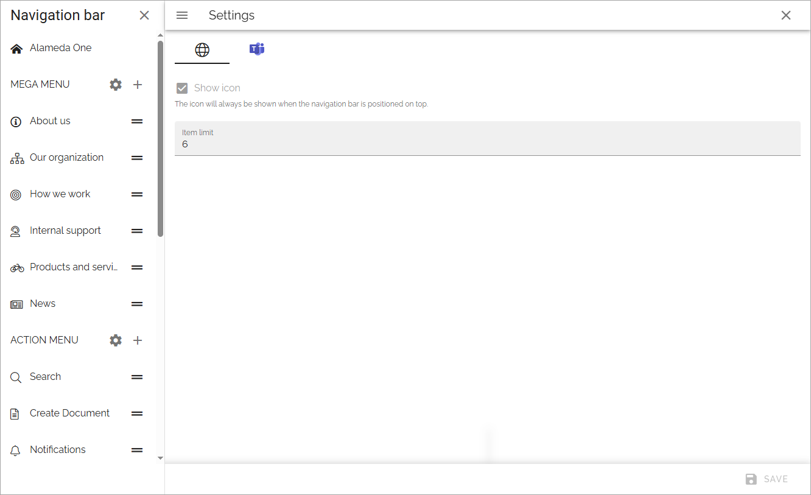

+ **Show icon**: For the top action menu, showing an icon is default. If you add other action menus, you can choose to show icons or not.
+ **Item limit**: Set the number of items that should be listed before a "Show more" link is shown.

See below for information on how to add action menu objects.

Adding a mega menu object
***************************
To add a mega menu object, click the plus and choose to add a layout or create a link.

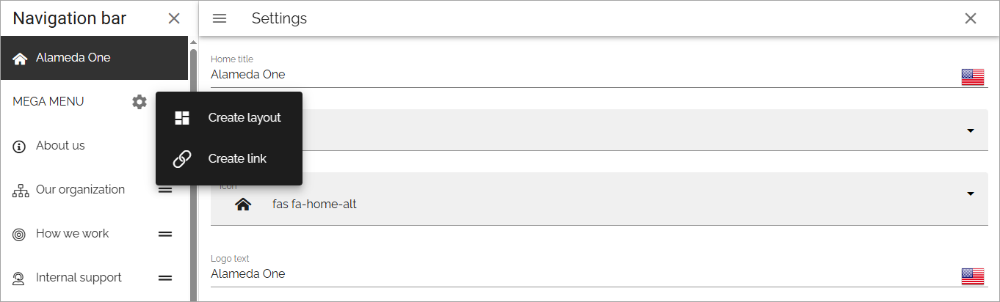

Create layout
--------------
When you choose to create a mega menu layout, the following is shown:

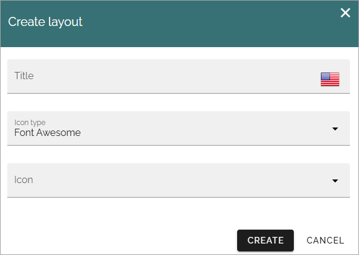

1. Add a title in any of the Tenant languages, and an icon if you like. 

What you add here is only shown in the list of mega menus, not shown for users.

2. Click "Create".
3. Create the mega menu layout by using sections and blocks available in Omnia.

For more information, see *Working with the layout* below.

Create a link
---------------
You can create a mega menu link to anything you can link to, for example a page in Omnia, or external functionality.

Set the following for the link:

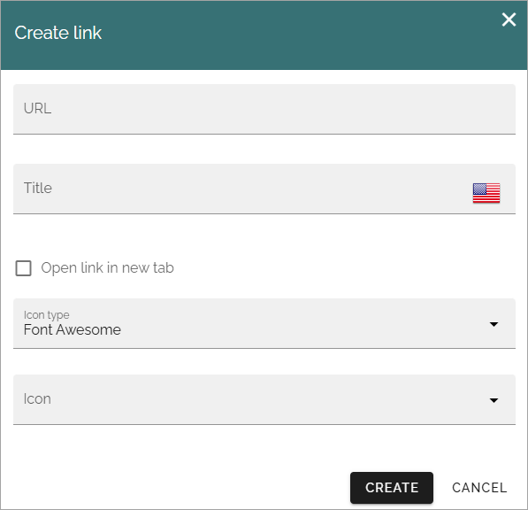

+ **URL**: Add the URL for the link here.
+ **Title**: Add a title in any tenant language here.
+ **Open link in new tab**: If the link should be opened in a new tab in the Browser, select this option.
+ **Icon type/Icon**: Add an icon for the link if you wish.

Mega menu object settings
---------------------------
Some settings are available for each mega menu object, here:

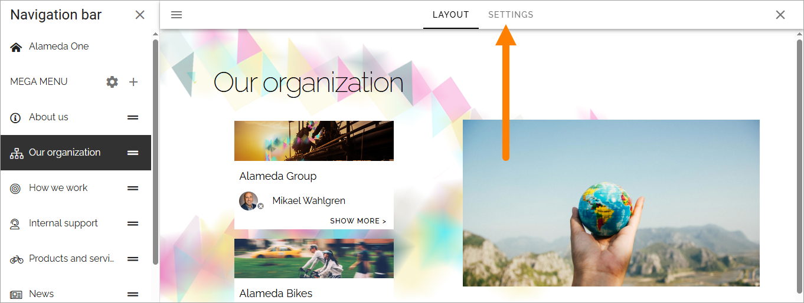

To edit them, click Edit:

.. image:: mega-menu-select-settings-edit-711.png

+ **Title**: You can edit the title for any of the languages.
+ **Icon type/Icon**: You can edit the settings for icon here.
+ **Inherit size from mega menu settings**: Per default, this object has the same size settings as the whole mega menu. If you want to set specific size settings for this object, deselect the option.
+ **Targeting**: Here you can set targeting for the mega menu object. You do that the same way as for many other options in Omnia. See this page for more information: :doc:`Using targeting </general-assets/targeting-in-omnia/index>` 
+ **A list of start URLs that will make the node selected**: This is a way of showing how different parts of the solution is connected. Any URL can make this node selected.

Adding an action menu object
******************************
The action menu can include almost any action available in Omnia. To add an action menu object, do the following:

1. Click the plus for ACTION MENU.

The following settings are available:

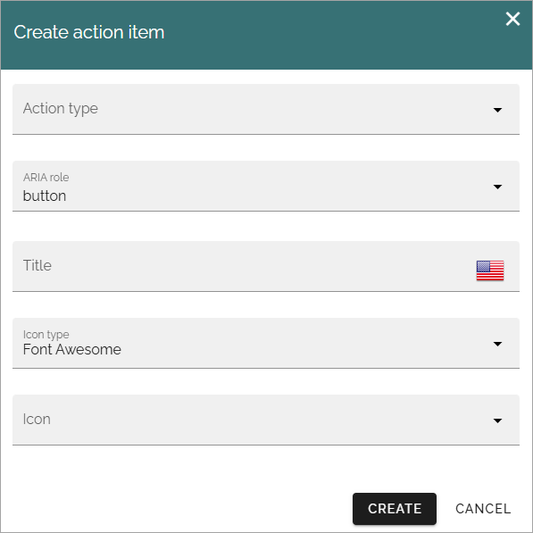

+ **Action type**: Select action type from the list. Note that these actions are the same as can be added using an Action button block.
+ **ARIA role**: (A description will be added soon).
+ **Title**: Add a title for the action here. If it's a button this will also be used as the tool tip. **Important note!** If you use several languages as system language in your solution, you have to add the title in all languages, otherwise the tool tip will be shown in the main language only.
+ **Icon type/Icon**: Add an icon if you wish.

Different fields are shown depending on action type selected. See this page for detailed information about those fields: :doc:`Action button block </blocks/button-link/index>`

Action menu object settings
-----------------------------
In the settings for an action menu object, you can edit some settings and set targeting:

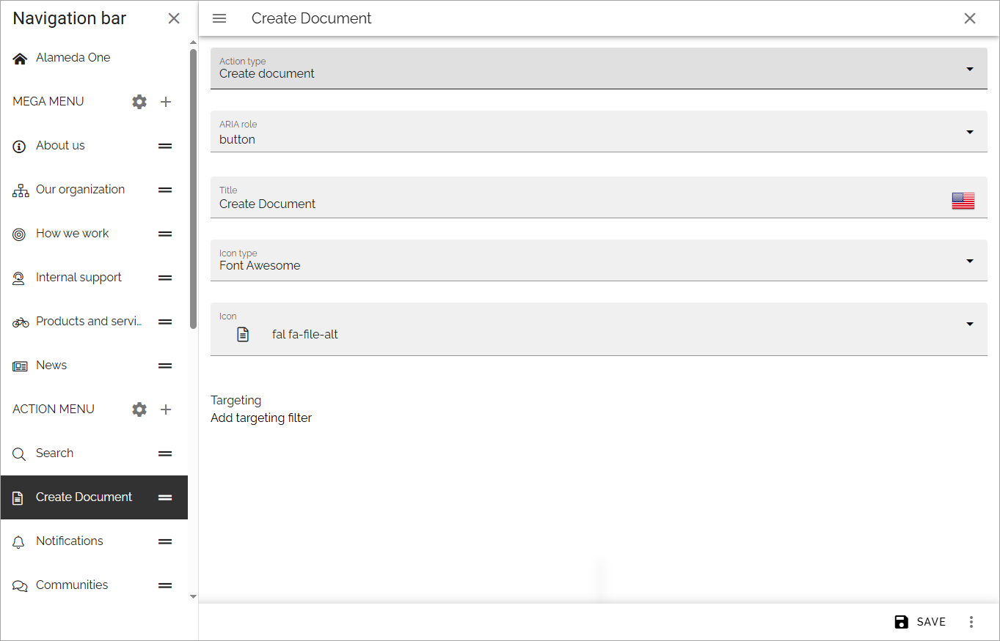

Targeting works the same way as for many other options in Omnia. See this page for more information: :doc:`Using targeting </general-assets/targeting-in-omnia/index>`

Edit the order
****************
If you have created several objects of one type, you can decide in what order these objects should be shown for users.

Use this icon and drag and drop the desired order:

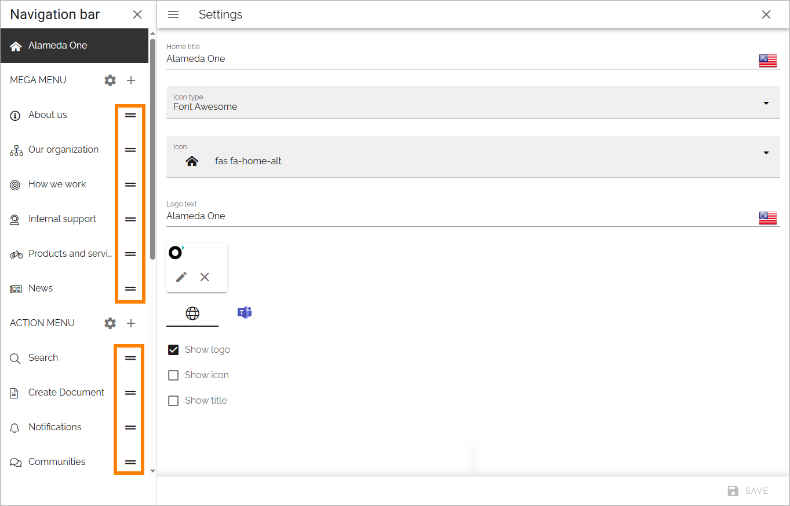

Working with the layout
*************************
You start your work with the layout by adding sections and blocks, the way this page describes: :doc:`Working with layouts </general-assets/working-with-layouts/index>`

**A tip:** One way of creating a mega menu-like navigation is to use a page rollup, with scope "Navigation path" and "Navigation view".

Different layouts for different screen sizes
----------------------------------------------
In addition to the options described above, you can add different layouts for different screen sizes, if needed.

The default screen size is for computer screens (called Large). You can use the other screen sizes to check what the layout will look like in smaller sizes, and decide if specific layouts for other sizes are needed. 

If you would like to add different layouts for one or more of the other scren sizes available, do the following:

1. Select Screen size.
2. Open the list.

.. image:: layout-screen-size-new-layout-711.png

3. Select and existing layout or create a new one.

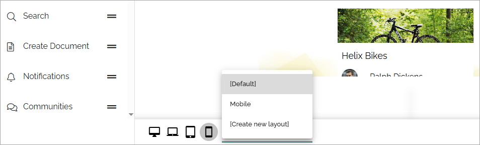

When you choose to create a new layout for this object, you can also copy from another published layout, to use it as a starting point.

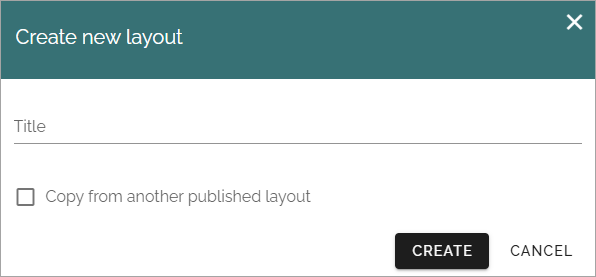

You work with the layout for the different screen sizes as described above.

