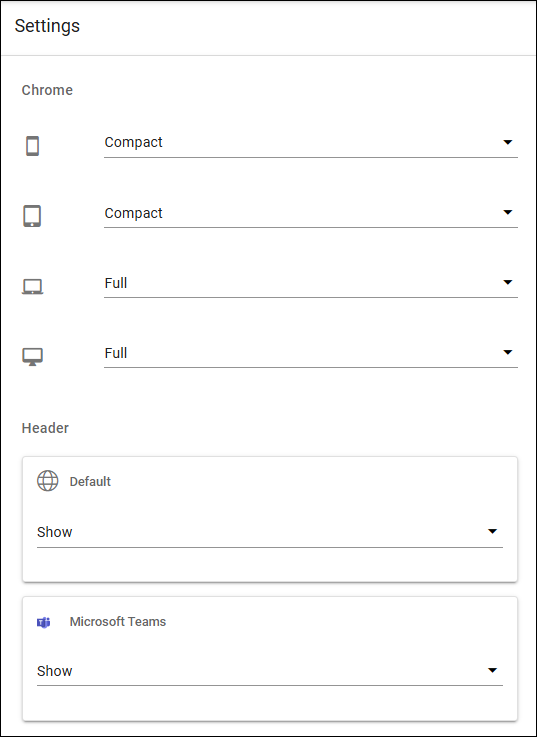
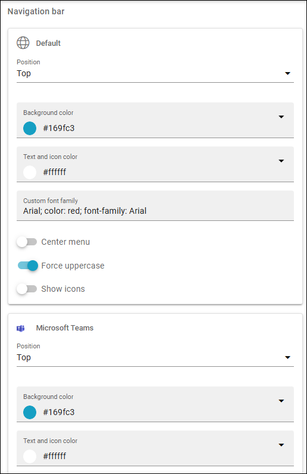

Settings (workspace) in Omnia 7.12
======================================

This page describes the workspace settings For Omnia 7.12 and later.

For the Workspace settings in Omnia 7.11 and earlier, see: :doc:`Settings for 7.11 </admin-settings/business-group-settings/workplace/settings/index>`

+ **Chrome**: Here you can choose Compact or Full chrome for the different screen sizes.
+ **Header**: Decide to show the header or not for the standard pages and/or for Teams.
+ **Navigation bars**: Decide where to show the navigation bar for the standard pages, Teams and the left panel. You can also set colors and some other settings.

(Settings for the left panel are the same as shown above).

