Block gallery
===================================

In Omnia 7.9 and later, an alternative way of listing the sections and blocks is available - the block gallery. Here's an example:

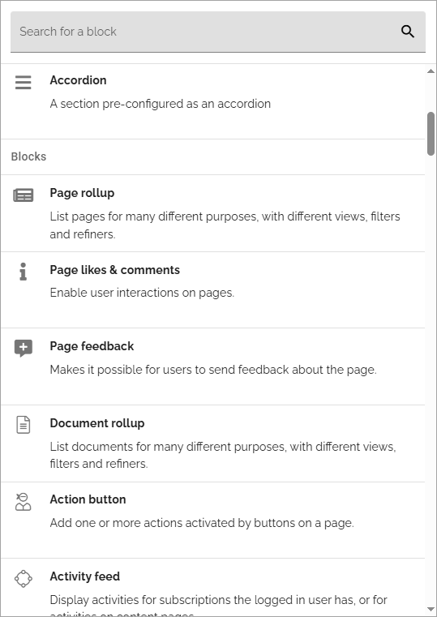

You can now choose to use this or the classic view.

The Block gallery is not just about listing, there are a lot of new options, see below.

Block gallery options
***************************
The following options are available in Omnia admin:

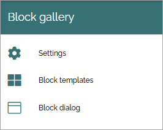

Settings
----------
It's here you choose wether to use the block gallery view or the classic view:

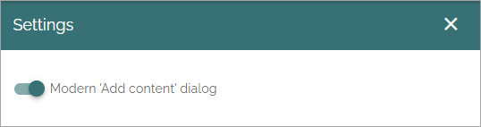

Not much to it, if you would like to use the block gallery view in the tenant, activate "Modern 'Add content' dialog", if you would like to use the classic view, don't. If you make changes here, don't forget to save. The SAVE option is found at the bottom of the dialog.

Block templates
-----------------
If you opt to use the block gallery view, you can also create block templates, which is blocks or sections (yes you can create section templates as well, despite the name of the option), with a number of pre defined settings, to make it easier for editors. It can also be used to make sure certain blocks or sections are set up the same way all over the tenant. The templates never replaces blocks or sections, it's always an addition.

You must also remember to add templates to the block dialogs (which do contain sections as well) where they should be available. 

Here's an example of a list with a number of templates created:

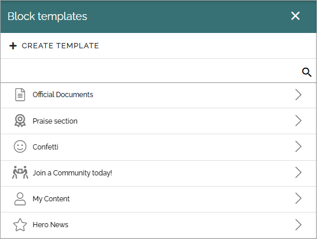

When you click CREATE TEMPLATE, the following settings can be used:

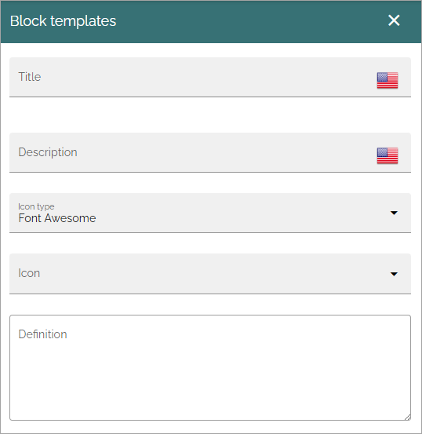

+ **Title**: Add a title to be shown in the list of templates.
+ **Description**: The description is displayed for editors, so it's important that it's clear what this template is about.
+ **Icon type/Icon**: Here you can choose to add an icon. Not mandatory.
+ **Definition**: The definitions used in the template is shown here.

Here's an example with definitions added:

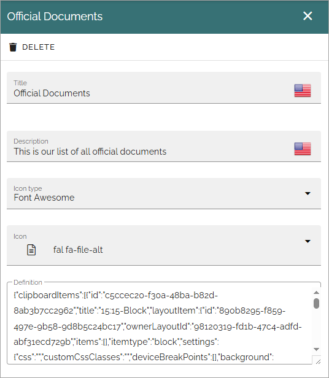

To delete a a template, just click DELETE, as seen at the top of the above image.

Creating a block template
----------------------------
How to create a template then? Use these steps:

1. Copy or add a block or section when editing a page.
2. Add the desired settings.
3. Copy the block/section to the clipboard (open the clipboard and click the Copy icon for the block/section).
4. Use the clipboard option for export (this copies the settings needed for the template to the computer's clipboard).
5. Create a new block template.
6. Paste the definition from the clipboard to the Definition field.

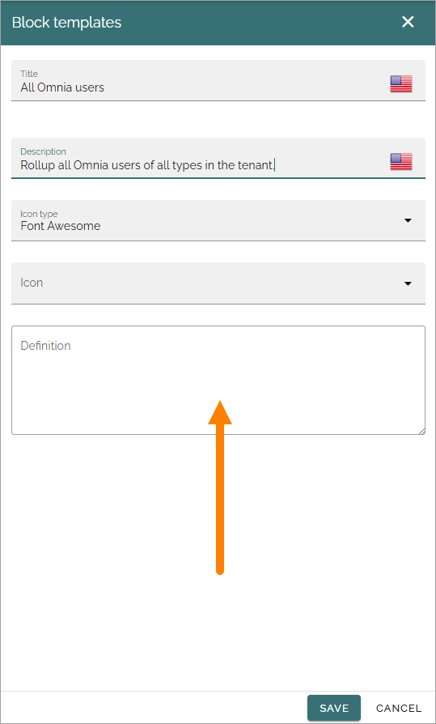

You should now see the definition in the field.

7. Save the new block template.

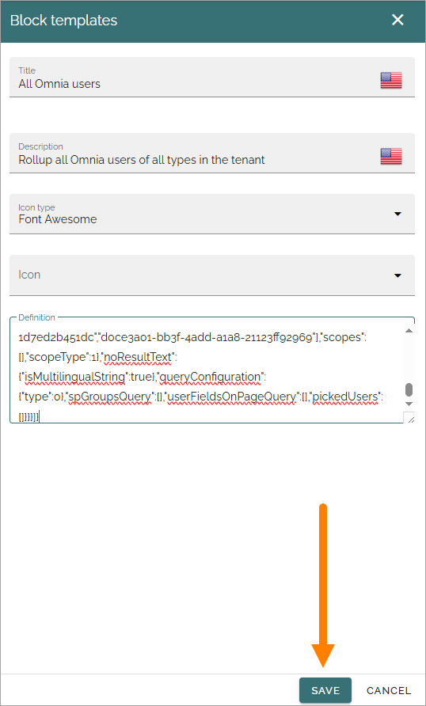

Note that the definition can be edited, if needed, but it's likely a faster way to change the settings in block/section, copy the settings, the same way as described above, and replace the whole definition in the field.

For more information about how to use the clipboard, see: :doc:`Clipboard for sections and blocks </general-assets/layout-explorer/clipboard-sections-blocks/index>`

Block dialog
---------------
Some different block dialogues are available. There you can select which blocks/sections and block should be available in that context, and set the order in which they are shown. 

The SPFx dialog is used for the Webpart functionality, Authentication and Form should be obvious and Default is used everywhere else.

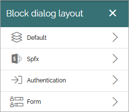

When editing a block dialog, it looks something like this (Default as an example):

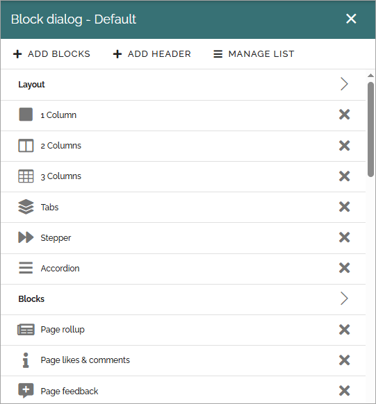

That said, it differs what you can add to the block dialogs.

+ Default; you can add and remove any block/section or template to your liking.
+ SPFx; you can add or remove the blocks available as a webpart.
+ Authentication; only a small number of blocks are available for this list but you can also add templates.
+ Form; you can add and remove any block/section or template to your liking.

You can add and work with headers in all lists. You can also manage the lists the same way. When you have selected MANAGE LIST, something like the following is shown:

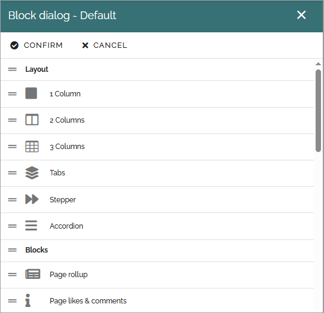

Use the icon to far left to move blocks/sections, templates and headings to the desired order.

