Business profiles
===========================================

Within a tenant several business profiles can be used, for different settings, for different areas of the tenant. Even if you will have the same settings everywhere in the tenant, you still need at least one business profile, to set, for example, themes (Colors) and content header settings.

Settings for teamwork, the notification panel, search, event management, workspace and app templates are also found among the business profile settings, to just mention some of the settings for a business profile.

When adding and editing settings for a specific Business Profile, you must first select the Profile in this list. The available settings for the Business Profile are then available.

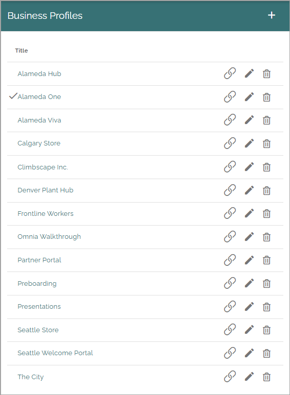

Use the icons this way: the left-most icon to edit Omnia alias, if applicable; the pen to edit the title and a few more settings; the dust bin to delete the business profile.

For descriptions of settings, see: :doc:`Business profile settings </admin-settings/business-group-settings/index>`

Regarding roles and permissions, some information can be found here: :doc:`Roles and permissions in Omnia </general-assets/roles-permissions/index>`

Edit Omnia alias
******************
If needed (and if it's applicable for the business profile) you can click the left-most icon to edit the Omnia alias.

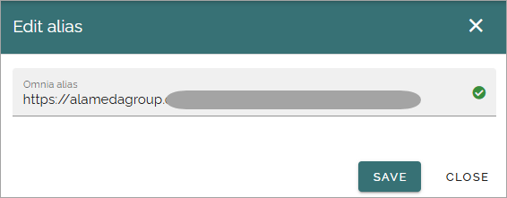

**Note!** Only one Omnia alias can exist. It's set here for the business profile, or for the workspace. If set in one of these places, it's then not available in the other one. 

If the root route is set for the business profile, it's shown this way:

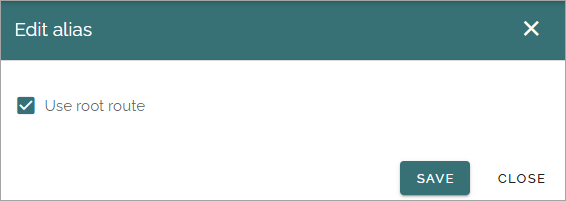

The root route can only be assigned once in the tenant, for a business profile's workspace or for an app. To "move" the root route to another business profile or app, first deselect the option here and then reassign the root route.

Create a new business profile
*******************************
To create a new business profile, click the plus:

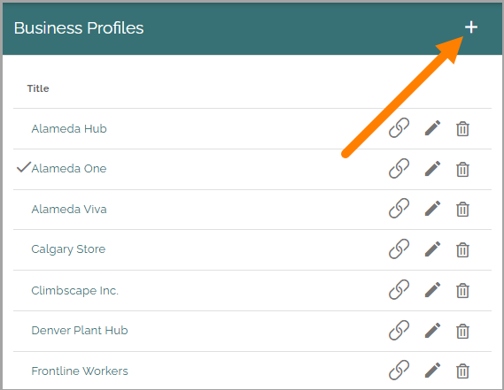

Use the following settings:

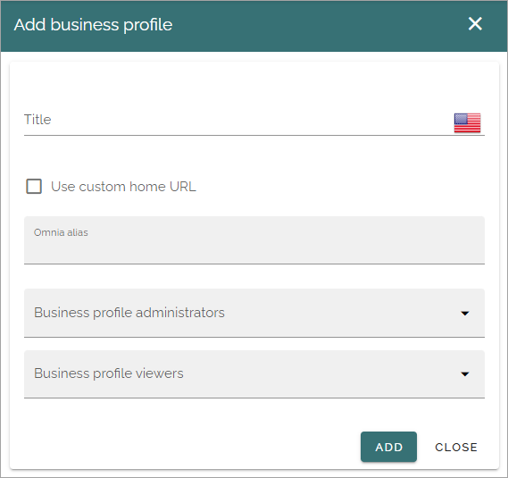

+ **Title**: Add a title (name) for the business profile here.
+ **Use custom home URL**: Select this option to set custom Home URLs, see below. 
+ **Omnia alias**: Add the URL for the business profile here.
+ **Business profile administrators**: Add one or more administrators for the business profile here.
+ **Business profile viewers**: Add one or more colleagues and/or groups that should be able to use the business profile.

Permissions for different parts of the business profile can then be set here: :doc:`Permissions for a business profile </admin-settings/business-group-settings/permissions/index>`

You must be tenant administrator or administrator for the business profile, to edit the settings there.

Custom home URL
-----------------
When you select "Use Custom home URL" a field is shown where you can set, yes you got it, a custom home URL:

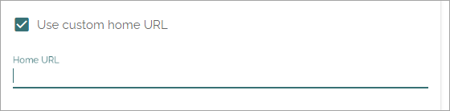

Edit a business profile
**************************
There is one option that is available only when editing a business profile:

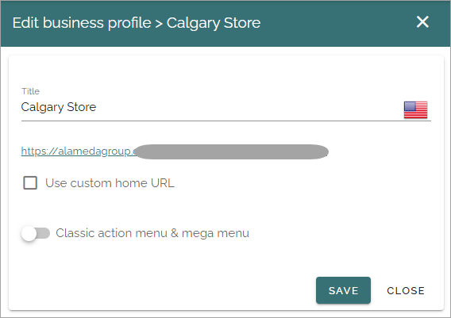

+ **Classic action menu & mega menu**: If you for some reason would like to use (more likely continue using) the older classic mega menu and action menu, select this option. In that case, you should do that directly after creating the business profile.

When this option is selected, the following information is found in the Workspace menu:

.. image:: Classic-info.png

There are also settings available for the workspace header:

.. image: business-profile-classic-77.png

Classic mega menu settings
*******************************
These settings are available when “Classic action menu & mega menu” is selected for the business profile. 

.. image:: workplace-header-classic-mega-menu-v7.png

Query
----------
Here you set the following:

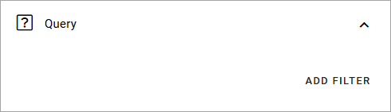

Click ADD FILTER to start the page picker to select part of (or the whole) the navigation tree for a page collection.

Don't forget to save when you're done.

For more information about the page picker, see: :doc:`The page picker </general-assets/page-picker/index>`

Display
------------
For Display, the following settings are available:

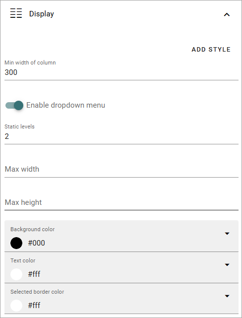

These settings are the same as in the mega menu block, see: :doc:`The mega menu block </blocks/mega-menu/index>`

Classic action menu settings
********************************
These settings are available when “Classic action menu & mega menu” is selected for the business profile, from a test environment. 

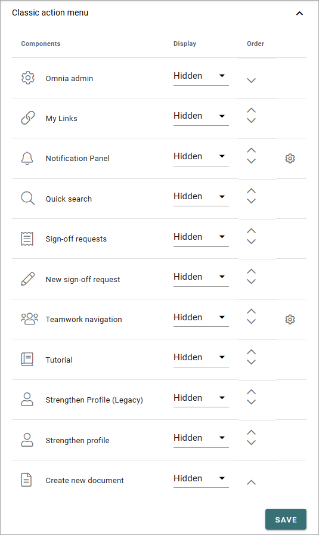

+ **Components**: This column lists the Components that can be displayed in the action menu. "Notification panel" and "Teamwork navigation" has additional settings, see below.
+ **Display**: You can decide which Components to display, and how: "Pinned", an icon will be displayed; "Hidden" - if you don't want the component to be available; "Menu" - if you want to display the component in the menu (the three standing dots) instead as an icon.
+ **Order**:  You can decide the order for the components you're displaying, from left to right.

Settings for notification panel
---------------------------------
These settings are available here:

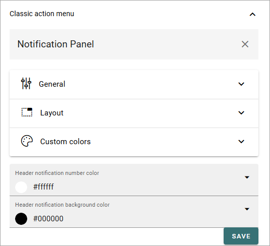

You use them the same way as in the block, see: :doc:`The Notification panel block </blocks/notification-panel/index>` 

Settings for My teamwork navigation
--------------------------------------
The following settings are available here:

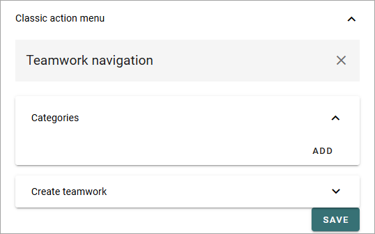

