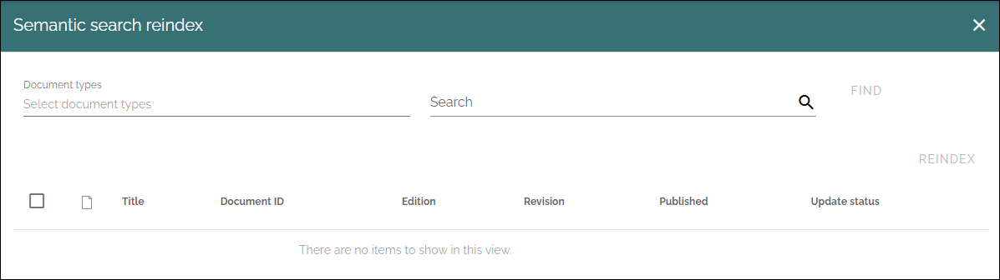
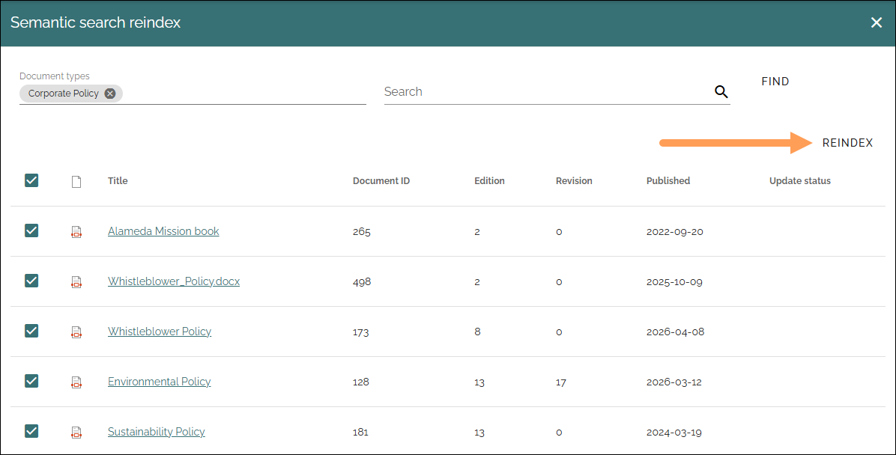
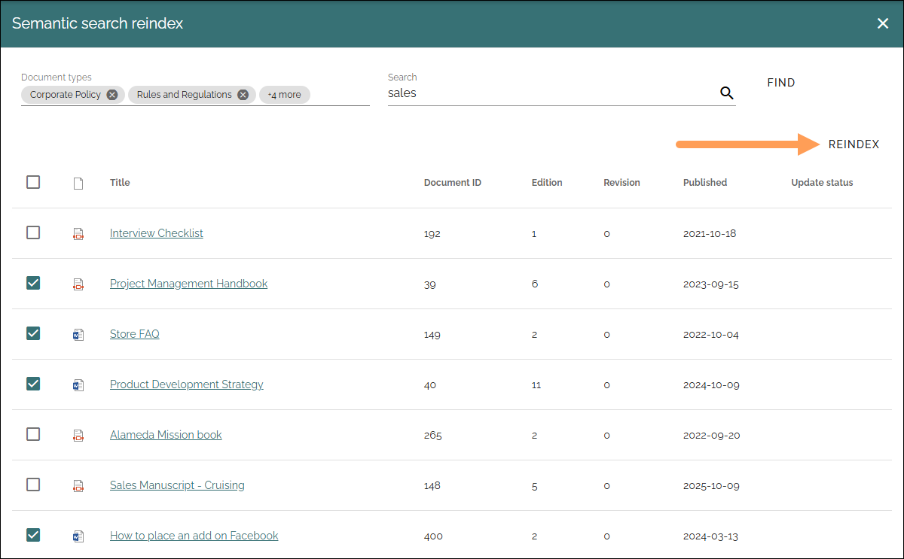

Semantic search reindex
=================================

Available in Omnia 7.12 and later. 

Use this to reindex documents for semantic search fast and easy. You can choose to reindex all documents, only some document types and even select individual documents.

For this option to be available, semantic search must be enabled in the tenant. Only documents whose document type is configured as semantic-search-indexable can show up in the list.

Also note that the user executing the reindex must have access to the documents that should be updated. Documents that the user does not have access to are simply not shown in the list.

Reindexing one or more document types
********************************************
1. Select one or more document types.
2. Click FIND.

A list of published documents of that document type is displayed.

3. Select some or all of the listed documents.
4. Click REINDEX.

Reindexing specific documents
********************************************
As you could see above, you can reindex selected documents even when you have chosen one or more document types. But you can also search for any documents regardless of document type and reindex them.

1. Select one or more document types, or just "All" to search in all documents.
2. Type what you will search for in the Search field.
3. Click FIND.
4. Select some or all of the listed documents.
4. Click REINDEX.

