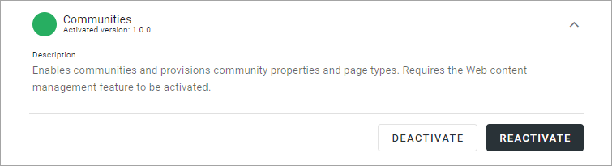
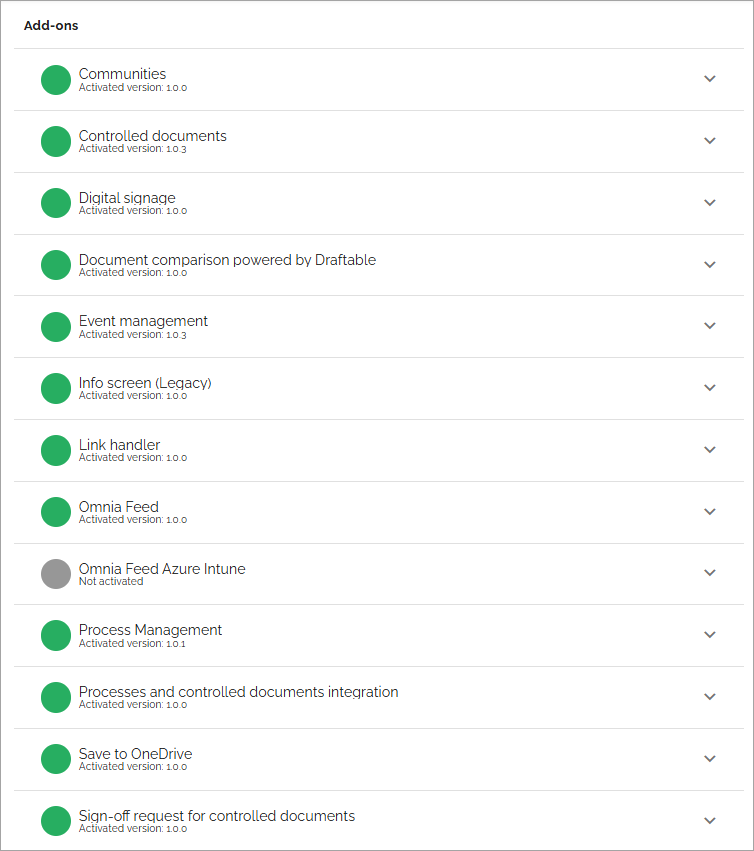
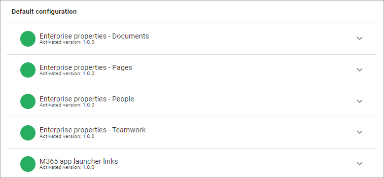
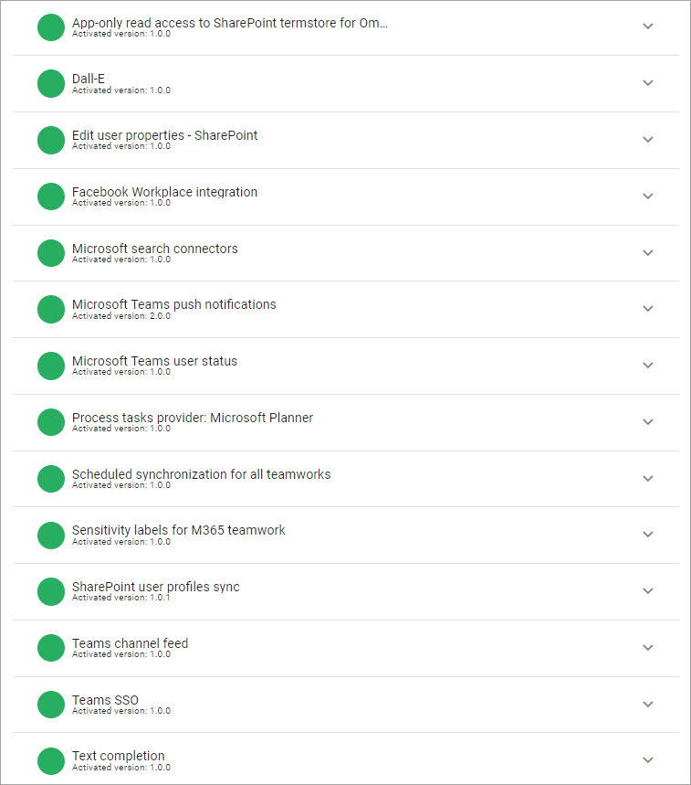
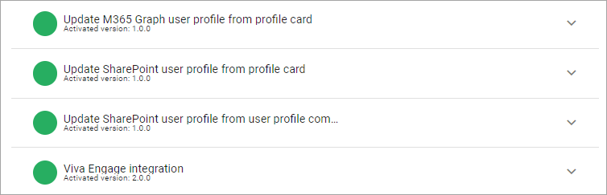
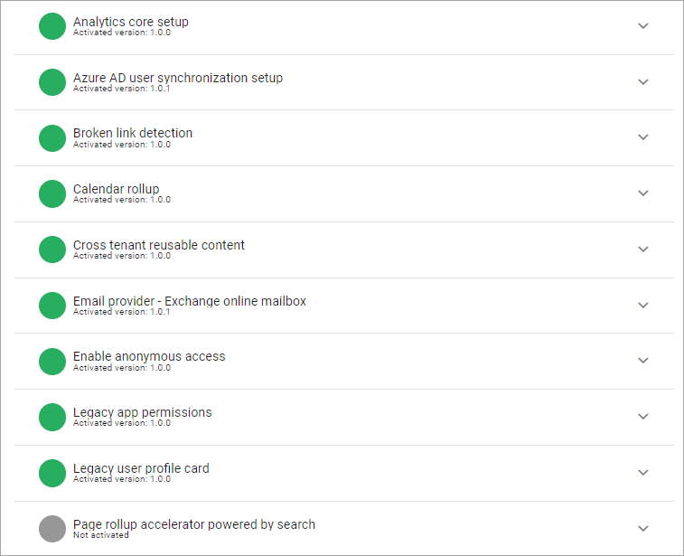

Features (Tenant)
=============================================

For a description of a feature, and when using any option, expand the feature:

Add-ons
*********
Here you can activate, remove or upgrade the Omnia Add-ons. 

For more information, see the links below:

+ :doc:`Digital signage </admin-settings/tenant-settings/settings/digital-signage-613/index>`
+ :doc:`See changes in a controlled document </user-options/see-changes-in-controlled-document/index>` 
+ :doc:`Sign-off requests </admin-settings/tenant-settings/sign-off-requests-613/index>`
+ :doc:`Using communities </using-communities/index>`
+ :doc:`Using Omnia Feed </using-omnia-feed/index>`
+ :doc:`Working with documents </working-with-documents/index>` 
+ :doc:`Working with events </working-with-events/index>`
+ :doc:`Working with processes </working-with-processes-v7/index>`

Default configuration
******************************
The purpose of these features is to provide a number of Enterprise Properties for an easy starting point, and ready to go app launcher links. You can then edit the properties lists and the app launcher links to your organization's needs. Add the common properties you would like to have in your tenant.

Note that default properties can not be deleted, but all can be edited. 

For more information on working with properties, see these pages: :doc:`Properties </admin-settings/tenant-settings/properties/index>`

Integration
*************
Here's an example of what can be available here:

and these:

When Microsoft Teams presence is active, this type of icon indicates Teams presence:

.. image:: teams-presence.png

In this example the icon indicates that the colleagues are offline at the moment.

For more information on how to set up Viva Engage (former Yammer) in Omnia, see:

:doc:`Setup Viva Engage in Omnia </setup/setup-yammer-in-omnia/index>` 

System
**********
The following is an example of features that may be avaialable here:

and these:

.. image:: tenant-features-system-more-75.png

**Note!** Page rollup accelerator is a very useful feature, should always be activated.

Regarding Teamwork provisioning using application context
--------------------------------------------------------------
The purpose of this option is to make sure users are only able to create Microsoft 365 Groups through Omnia templates. Note that additional settings needs to be made, to make sure Microsoft 365 Group can not be created any other way. More information can be found on this Microsoft page: https://docs.microsoft.com/en-us/microsoft-365/solutions/manage-creation-of-groups?view=o365-worldwide

