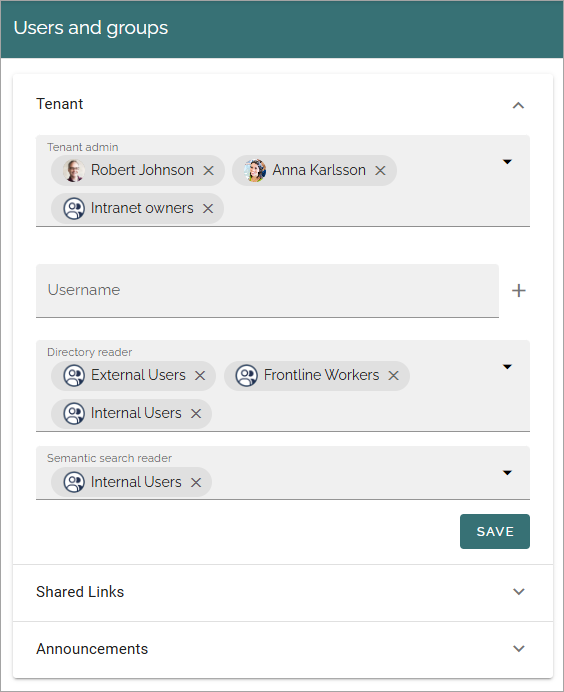
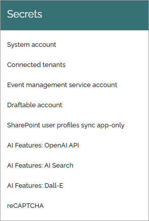
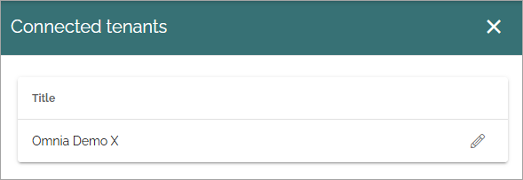

Permissions for the tenant
============================

The following settings are found here:

Users and groups
******************* 
Use this setting to add and remove tenant administrators and separate administrators for shared links and announcements, if needed. Only tenant administrators can use this setting. A tenant administrator can also edit all the settings for all business profiles within the tenant. (Image from Omnia 7.8).

To delete an administrator in any of the lists, just click the x. To add an administrator, add the name the same way as in other name fields.

**Note!** There must always be at least one tenant administrator. If there is only one, that administrator can not be removed until an additional administrator has been added.

If you see a field called "Username", as in the image above, it's a special case that can be necessary to handle when setting up a new tenant. As the user sync can't be executed until the tenant has been setup, you may need to add a tenant administrator in this field, in this special circumstance.

For more information on the people picker, see: :doc:`Using the people picker </general-assets/using-people-picker/index>`

The semantic search reader setting
--------------------------------------
Semantic search is a new AI feature that can be available in Omnia 7.8 and later (if semantic search is activated in the tenant). Add the colleagues and groups that should be able to use semantic search. 
If a search block is set up with semantic search and certain users are not allowed to use the feature, they get empty search result if trying to use this search block. Also note that other permissions apply as usual. 

If pages or documents should be available for semantic search can be set at page collection level for pages, and in document types for controlled documents. Semantic search does not work for other types of documents yet.

**Very important!** The semantic search will soon be developed further in Omnia but for now it does **not support security trimming**. Therefore, semantic search should only be used for common information that anyone in the organization have permission to read, for now. 

This permission settings can be another way of restricting who can read information gathered by semantic search.

Secrets
********
A number of settings are available under Secrets. Exactly what is available here depends on the implementation. Here's a common example from Omnia 7.7: 

In Omnia 7.8 some options have been renamed and a few added:

System Account
------------------
System account is a standard extension for specialized implementations only, normally used by developers.

Connected tenants
------------------
This option is connected to the cross tenant publilshing functionality. The first list simply lists the other tenant this tenant is connected to, for example:

By clicking the pen, you can edit these settings:

You have to communicate witth a tenant edmin to recieve the information you neeed for these two fields.

Event Management service account
----------------------------------

If you will be using Event Management with a connection to calendars in Outlook, you must add the service account that will be used to read and write from the calendars in the tenant. (Don't forget that this account needs permissions to that calendar.)

Draftable account
---------------------
If you're using Draftable's solution for comparing changes in controlled documents, you may have to edit the information here.

A default base URL is added but can be edited if needed. 

SharePoint user profiles sync app-only
-----------------------------------------
In the process of enabling SharePoint app-only, Client ID and Client secret must to be added here.

Azure OpenAI text completion configuration
--------------------------------------------
(Called AI features: OpenAI API in 7.8).

To be able to use AI text functionality within Omnia, the tenant feature "Text completion" must be activated. When that is done, an API key and an API base URL must be entered here

AI features: AI search
------------------------
Available in Omnia 7.8 and later. (A description will be added soon.)

Azure OpenAI Dall-E configuration
------------------------------------
(Called AI features: Dall-E in 7.8).

To be able to use the Dall-E functionality within Omnia, the tenant feature "Dall-E" must be activated. When that is done, an API key and an API base URL must be entered here.

**Important note!** The model version should be dall-e-3 and the deployment name needs to be “Dalle3” in Omnia 7.7, when setting up Dall-E.

reCAPTCHA
-----------
If you would like to use reCAPTCHA, you must enable it here and add a site key and a secret key.

