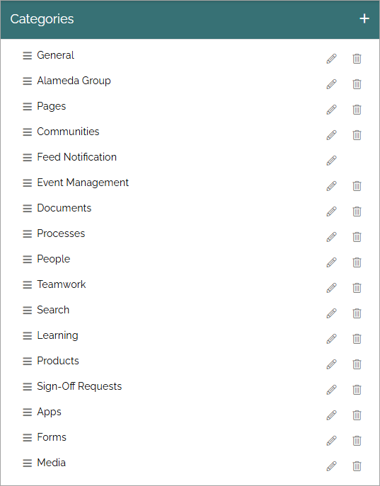
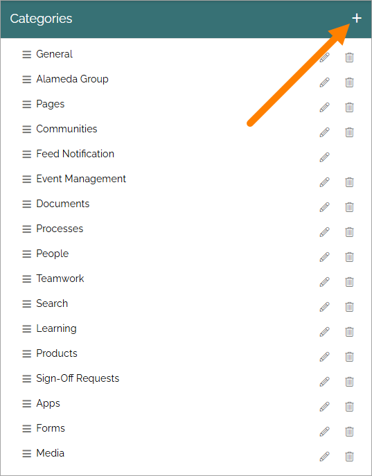
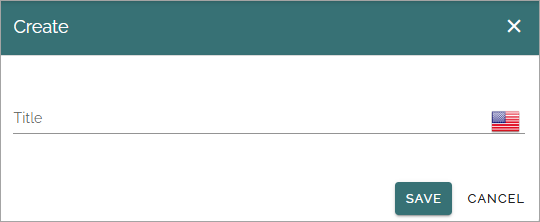

Categories (Properties)
=======================

You can categorize properties for example to make it more obvious what different properties are for.

Here's an example of a list of categories:

Use the pen to edit a category or the dust bin to delete it.

You can also change the order in wich categories will be shown in various lists. Just grab the titel and move the category to the desired position.

Create a new category
***********************
To create a new category, do the following:

1. Click the plus.

2. Type a Title (Name) in any tenant language and save.

