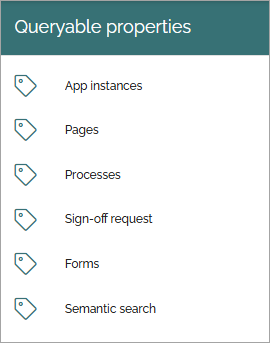
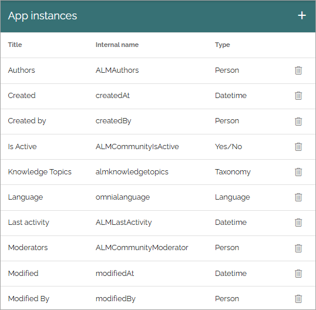
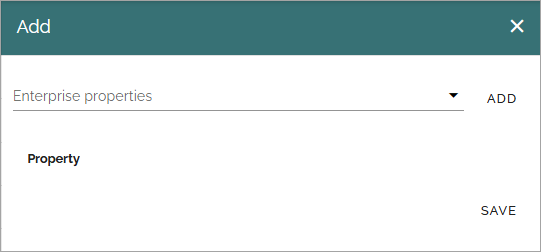
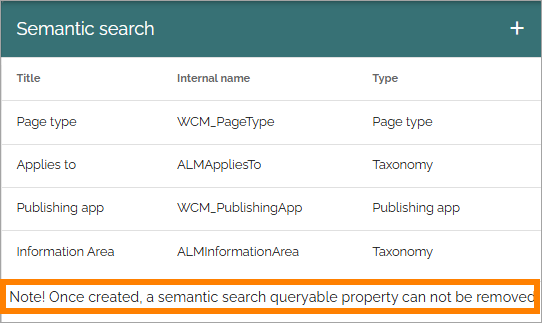

Queryable properties
===========================

Here, you add properties that should be queryable in Omnia's database. The properties are used in the query builder, so far in these blocks:

+ **App Instances**: In Teamwork rollup.
+ **Pages**: In Page rollup.
+ **Processes**: In Process rollup.
+ **Sign-off Request**: In Sign-off requests rollup.
+ **Forms**: In the Forms rollup.

**Semantic search** is a different case. These properties are used so that search block instances that use the semantic search category with the appropriate scope, can be created. They are the metadata of the indexed documents/pages. 

To be available here, a property must first be added to Enterprise properties. 

These lists are available here:

The lists are handled the same way. Here's part of the list for App instances as an example (but note that queryable properties for semantic search works a bit differently, see below):

To remove a poperty from the list, click the dust bin.

To add a property, do the folllwing:

1. Click the plus.

This is then shown:

2. Select an enterprise property in the list and click ADD.
3. Add more properties if applicable (meaning all selected will be added to the list).
4. Save when you're done.

A note about Semantic search
*******************************
Note that once a queryable property for semantic search has been created, it can't be removed, as stated at the bottom of the list.

