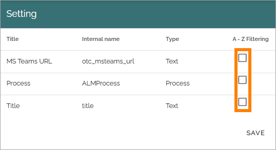

Queryable properties
===========================

Here, you add properties that should be queryable in Omnia's database. The properties are used in the query builder, so far in these blocks:

+ **App Instances**: In Teamwork rollup.
+ **Pages**: In Page rollup.
+ **Processes**: In Process rollup.
+ **Sign-off Request**: In Sign-off requests rollup.
+ **Forms**: In the Forms rollup.

**Semantic search** is a different case. These properties are used so that search block instances that use the semantic search category with the appropriate scope, can be created. They are the metadata of the indexed documents/pages. 

In Omnia 7.10 and later, A-Z filtering can be added for queryable properties (except for Semantic search), see below.

To be available here, a property must first be added to Enterprise properties. 

These lists are available here:

The lists are handled the same way. Here's part of the list for App instances as an example (but note that queryable properties for semantic search works a bit differently, see below):

To remove a poperty from the list, click the dust bin.

To add a property, do the folllwing:

1. Click the plus.

This is then shown:

2. Select an enterprise property in the list and click ADD.
3. Add more properties if applicable (meaning all selected will be added to the list).
4. Save when you're done.

A note about Semantic search
*******************************
Note that once a queryable property for semantic search has been created, it can't be removed, as stated at the bottom of the list.

A-Z filtering
---------------
**This description is just started. the info is preliminary**.

In Omnia 7.9 and later, A-Z filtering can be added for queryable properties for Appinstances, Pages, Processes, Sign-off requests and Forms. **Note!** A-Z filtering can only be activated for properties of type Text and type Processes.

A-Z filtering is a complementary filtering solution. When used, a list can be filtered on any of the letters that exist in the data set. And it's not just A-Z. If a language has special letters in the alphabet, A-Z filering works for those letters as well.

Here's an example where A-Z filtering is used:

As you can see, not all letters exist in that data set, for example D and J, and those letters are then simply not shown as filters. To filter, you click the letter, just as you would with other filters.

For A-Z filtering to work, you must set it up for all applicable queryable properties.

When creating a queryable property, if the property is of the right type (Text or Processes). you can select A-Z filtering for it:

You can also set this up for existing queryable properties this way:

1. Click the cogwhell for the group.

A list of properties, of type Text and type Processes, are shown. Here's an example.

2. Select the properties that should be available for A-Z filtering and save.

