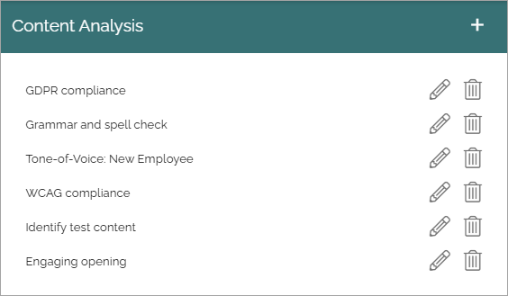
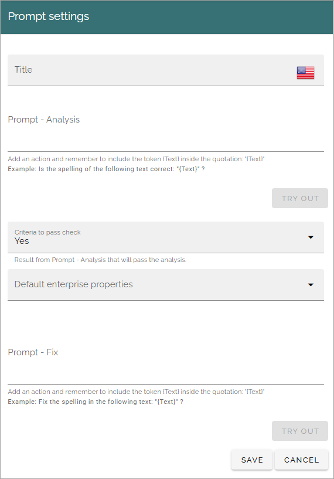
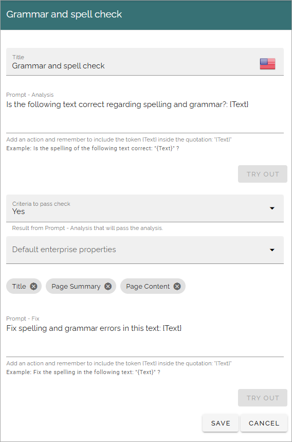

Content analysis (AI Engine)
=============================================

These are the available settings for content analysis functionality in Omnia 7.8. If you have used this option in 7.7 for OpenAI, it works the same.

You can set up a number of prompts for content analysis, to be used by editors. Here's an example:

Click the pen to edit, the dust bin to delete.

All settings are available for edit, see below.

Create a new analysis
************************
When creating a new analysis, the following settings are available:

+ **Title**: Add a title for this setting, in any available tenant language. Mandatory.
+ **Prompt - Analysis**: Add the text (the instruction to the AI Engine) for the prompt here. Note the message under the field. The prompt must contain the token {Text} within quotation marks.
+ **Criteria to pass check**: Can be Yes or No.
+ **Default enterprise properties**: Select one or more properties here. What you add here will be the text fields that will be analyzed.
+ **Prompt - Fix**: You can add a prompt to ask the AI Engine to fix something in the content, for example to fix the spelling.
+ **TRY OUT** You can try out the settings by clicking this button.

Here's an exaple of content analysis prompt:

