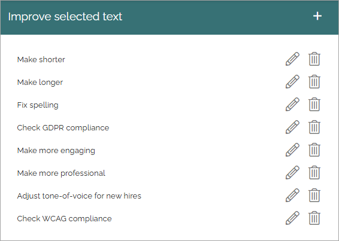
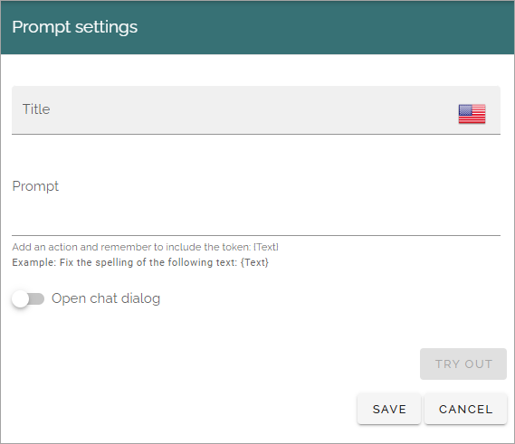
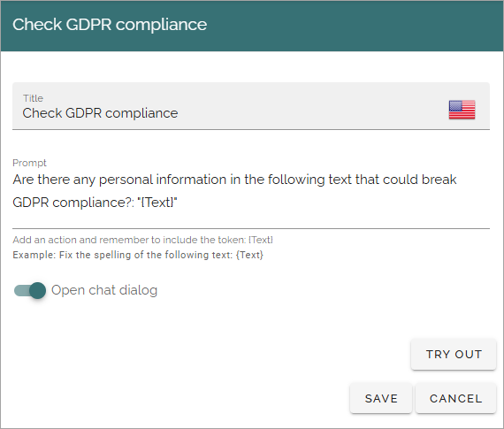

Improve selected text (AI settings)
=============================================

This is the functionality in Omnia 7.8 and later. If you have used this option in 7.7 for OpenAI, it works the same, but with one addition, see the bottom of the page.

You can create a number of prompt settings here to be used by editors, for example:

Click the pen to edit, the dust bin to delete.

All settings are available for edit, see below.

Create a new prompt setting
******************************
The following are available for a new prompt setting:

+ **Title**: Add a title for this setting. Mandatory.
+ **Prompt**: Add the text (the instruction to the AI) for the prompt here. Note the message under the field. The token {Text} must be added here, within quotation marks. See below for an example.
+ **Open chat dialog**: If the chat dialog should open, select this option. This can be useful for editors, as they can continue communicating with the AI Engine to make addtional changes.
+ **TRY OUT**: You can try out the settings by clicking this button.

Here's an example of a prompt:

See the bottom of this page for information about how OpenAI/AI can be used in the RTF editor: :doc:`Editing text with the RTF Editor </general-assets/rtf-editor/index>`

Using Improve selected text as a pre publishing policy
*********************************************************
The prompts set up here can also be used as pre publishing policies, in Omnia 7.8 and later. This can be used by editors to let AI review the page before publishing.

The setting is done on page collection level. For more info, see: :doc:`Page collection settings </pages/page-collections/page-collection-settings/index>`

