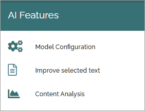

AI features
==================================

The following options are available here in Omnia 7.8 and later:

Prerequisite: An Azure Open AI subscription is needed for the AI features to be available in Omnia.

See this page for important information on how to set up AI in your tenant: :doc:`Setup AI </setup/setup-ai/index>`

Select section for more information.

.. toctree::
   :titlesonly:

   settings-ai-engine/index
   improve-selected-text-ai-engine/index
   content-analysis-ai-engine/index
 
