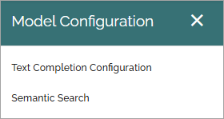
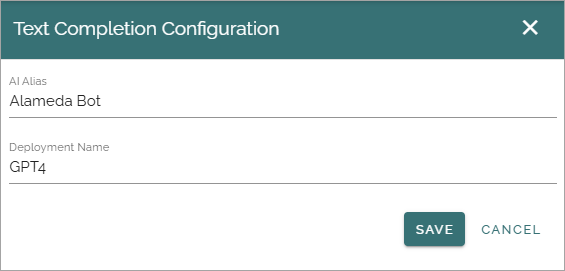
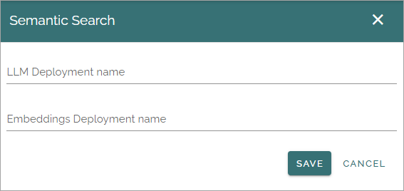

Model configuration (AI)
=============================================

This description applies to Omnia 7.8.

**(This page is being edited).**

The following settings are available here:

Text completion configuration
*******************************
The following options are available here:

+ **AI alias**: Add the label to be used in the UI here.
+ **Deployment name**: Add the name for the deployment you are using. 

Semantic search
*******************
The tenant feature "Semantic search" must be active for this functionality to be available.

**Very important!** The semantic search will soon be developed further in Omnia but for now it does **not support security trimming**. Therefore, use semantic search only for common information that anyone in the organization have permission to read. If semantic search should be used can be set at page collection level for pages, and in document types for controlled documents. Semantic search does not work for other types of documents yet.

Semantic search can be used alongside classic search. It can be decided where to use semantic search by creating one or more search categories with semantic search as search provider.

These settings are available for semantic search:

+ **LLM deployment name**: (A description will added soon).
+ **Embeddings deployment name**: (A description will added soon)

For more information about semantic search, see: :doc:`About semantic search </general-assets/about-semantic-search/index>`

