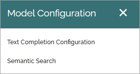
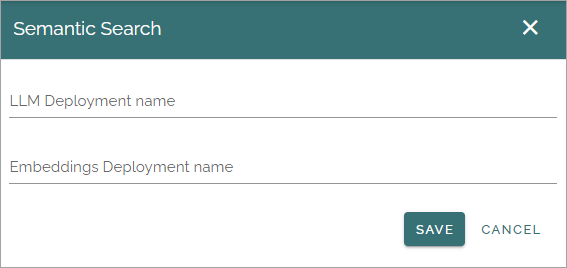

Model configuration (AI)
=============================================

This description applies to Omnia 7.8 and later.

See this page for important information on how to set up AI in your tenant: :doc:`Setup AI </setup/setup-ai/index>`

For current model IDs and deployment recommendations, see: :doc:`Recommended AI models </setup/recommended-ai-models/index>`

In Omnia 7.8, the following settings are available here:

In Omnia 7.9 and later, image-generation settings are also available. The label depends on the Omnia version and the activated image-generation feature.

Text completion configuration
*******************************
The following options are available here:

+ **AI alias**: Add the label to be used in the UI here.
+ **Deployment name**: Add the name for the deployment you are using. For new deployments, see :doc:`Recommended AI models </setup/recommended-ai-models/index>`.

Semantic search
*******************
The tenant feature "Semantic search" must be active for this functionality to be available.

**Very important!** The semantic search will soon be developed further in Omnia but for now it does **not support security trimming**. 

These settings are available for semantic search:

When you have created the services you need in Azure Open AI, you add services here.

+ **LLM deployment name**: Add the Large Language Model deployment you will use in Omnia.
+ **Embeddings deployment name**: Add the name of the embeddings deployment you have created.

For more information about semantic search, see: :doc:`About semantic search </general-assets/about-semantic-search/index>`

GPT Image
*********
The tenant feature **GPT Image** must be active for this setting to be available. Add the name of the GPT Image deployment you're using here. For new deployments, see :doc:`Recommended AI models </setup/recommended-ai-models/index>`.

Older Omnia versions can display a legacy **Dall-E** setting instead. Retain it only for an existing Dall-E configuration; it is not recommended for a new deployment.

