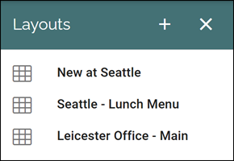
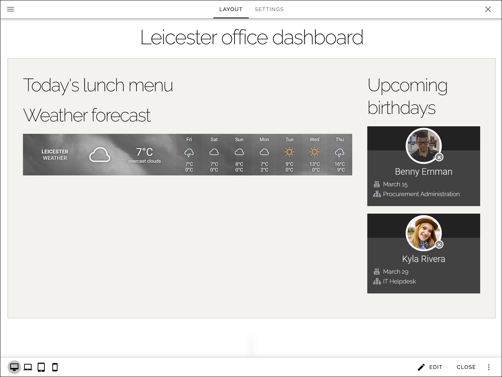

Layouts (Digital signage)
=============================================

Here you create layouts to be used for digital signage. You can use these layouts when you create screens for a web browser.

If there are some publishing layouts created, they will be listed here, for example:

To edit a layout, just click the name. All settings available when creating a new layout can be edited. Here's an example:

Regarding creating a new layout you do that almost exactly like other layouts in Omnia. Not all options may be applicable for Digital signage layouts, but it's up to you.

For more information, see: :doc:`Working with layouts </general-assets/working-with-layouts/index>`

