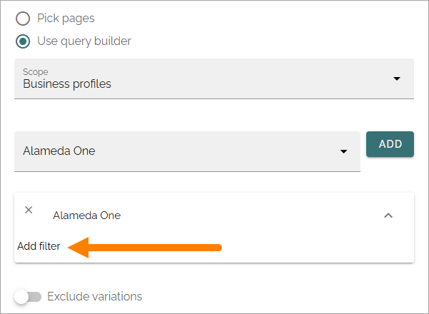

Page rollups (Digital signage)
=============================================

Here you set up rollups to be used for digital signage. You can use these rollups when you create screens for a web browser.

The list displays rollups that has been set up so far, for example:

When you click the plus to create a new rollup, the following settings are available:

(All options are not shown in the image).

Add a title for the rollup at the top and use the tabs for settings:

QUERY
*******
You work with these settings in a similar way to those in the Page Rollup block.

+ **Pick pages**: To pick specific pages, select this option.
+ **ADD PAGE**: When you have selected "Pick pages", you can pick pages using the page picker. See this page for more information: :doc:`The Page picker </general-assets/page-picker/index>`
+ **Use query builder**: If you want to use the query builder to choose pages, select this option.

For Query builder, the following options are available:

+ **Scope**: When you have chosen to use the query builder, select scope for the block. This is where you choose where to get the pages from. You can select:

  + Tenant.
  + Business profile(s).
  + Publishing app(s).
  + Page collection(s).
  + Navigation path.
  + Channel(s).

When you have selected Business profiles, Publishing apps, Page collections or Channels, you select one or more to get the pages from as the next step, just as you would in the Page rollup block. 

If you select Tenant, Business profile or Publishing apps as the scope you can add filters for what you want to display in the list, see below.

The following settings can then be available, depending on scope chosen:

+ **SELECT START NODE**: Available for scope Navigation path. Choose the start point for the navigation path to be displayed. If you select "Custom", you can use the Page Picker to select start node.
+ **Exclude start node**: Available for scope Navigation path. If the start page selected should not be displayed, select this option.
+ **Exclude variations**: Usings this option, you can exclude variations from the query. Not available for Navigation path.
+ **Trim duplicates**: If more than one Rollup is added to a layout, this option can be used to handle duplicates between the rollups. When the option is selected, you can enter a number indicating the priority for duplicates, for this rollup. If you set "1" for a rollup it means it has priority showing a post that would have been a duplicate. 
+ **Like, Comment, Rating**: Use these settings to decide the time period calculated for any of these options. If you don't select anything, it means "No Limit". You can select one week, two weeks or one month instead.
+ **Navigation Depth Level**: Available for scope Navigation path. Choose the number of nodes that should be displayed, including the start node (if shown).
+ **Item Limit**: Type the number to set the number of pages that should be retrieved to make sure all duplicates are found. You should not set this number higher than you really need, as higher numbers may have an impact on performance. Note that when you change the number, "Max Display Limit" is also changed, see below.
+ **Sort by**: Select a property to sort the list by, and then choose Ascending or Descending.

Filter on Tenant
----------------
When you have selected Tenant as the scope, you can add filters for what you want to display, by clicking here:

Filter on Business Profile or Publishing App
----------------------------------------------
When you have selected Business Profile or Publishing Apps as the scope, and added one or more, you can add filters for what you want to display for each selected, by clicking here:

VIEW
******
Use this tab for view settings, similar to those in the Page rollup block:

.. image:: rollups-signage-view-78.png

(Not all options are shown in the image, but described below.)

+ **Title, Summary, Content, Image**: Select property to get the information from, for each of these.
+ **Image ratio**: For the selected image property, choose Square or Wide here.
+ **Created by, Created at**: Select property to get this information from.
+ **Text column width**: Set the text column width in pixels. 
+ **Delay time before scroll (seconds)**: Set the delay time before next scroll.
+ **Scrolling speed**: Use the slider to set speed of the scroll.
+ **Delay time after Scroll (seconds)**: Set the delay time after a scroll.
+ **Scrolls whole page**: Select this if you want the whole page to scroll.
+ **Show likes/comments**: Select if page likes and comments should be shown on the screen.
+ **Show logo**: To display a logo, select the option and use the settings.
+ **Logo URL**:  Available when "Show logo" is selected. Add the URL to the logo here.
+ **Logo position**: Available when "Show logo" is selected. You can choose to display the logo Top Right, Bottom Right, Top Left or Bottom Left.
+ **Logo size**: Available when "Show logo" is selected. Use the slider to set logo display size.
+ **Show indicator**: Select this option to display an indicator.
+ **Indicator position**: Available when "Show indicator" is selected. You can chose to display the indicator Top right, Bottom right, Top left or Bottom left.
+ **Slides indicator color**: Available when "Show indicator" is selected. Use this option if you need to change indicator color for the slides.
+ **Count down text color**: Available when "Show indicator" is selected. Use this option if you need to change the count down text color.
+ **Show QR code**: To display a QR code so the page can be easily read on a mobile, select this option.
+ **QR code text**: Available when "Show QR code" is selected. You can add a text here, to be shown by the QR code.
+ **QR code poistion**: Available when "Show QR code" is selected. You can choose to display the QR code Top right, Bottom right, Top left or Bottom left.
+ **QR code size**: Available when "Show QR code" is selected. Use the slider to set the display size of the QR code.

