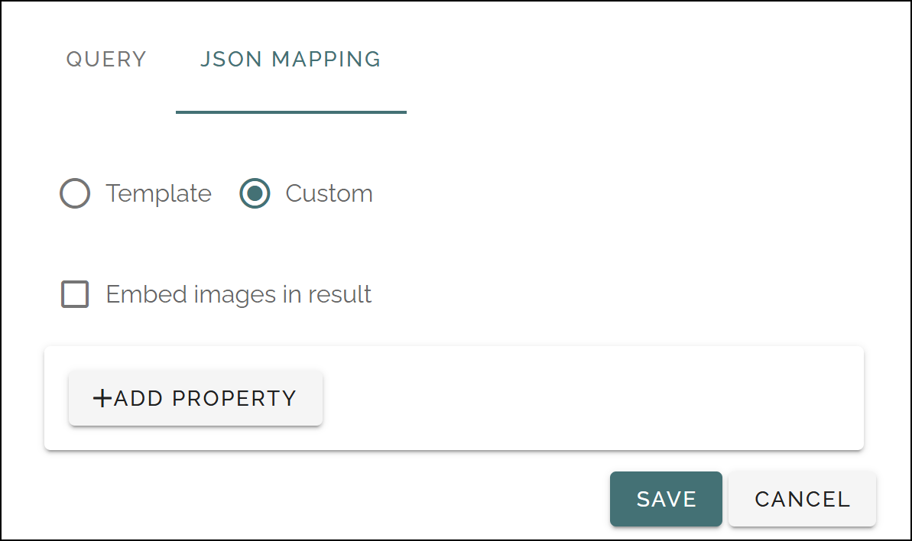

Screens (Digital signage)
=============================================

Use these settings to set up different screens to be used for digital signage.

The screens that has been set up so far is listed, for example:

.. image:: digital-screens-list-711.png

Use the icons to (from left to right): 

+ Show the URL to the screen.
+ Launch a preview.
+ Edit the settings for the screen.
+ Delete the screen.

When you click the plus to create a new screen, the following settings are avilable:

.. image:: digital-screens-settings-711.png

+ **Title**: Add a title for the screen. Not shown for users.
+ **Screen ID**: Here you can add an internal, unique name/ID for the screen.
+ **Screen type**: Select of a web browser will be used on the screen, or a third party client. If you select "Third-party clinet here, a number of options is available, see below.
+ **ADD STEP**: Available for screen type Web browser. Use this to add steps for the screen. Can be rollups and/or layouts created for digital signage. For more info, see below.

Adding web browser steps
**************************
When you click ADD STEP, the following is avaialable:

.. image:: digital-screens-addstep-711.png

+ **Step type**: Select Page Rollup or Layout here.
+ **Page rollup/Layout**: Select a page rollup or layout to be used for this step. For anything to show up here, page rollups or layouts for digital signage must have been created.

When you have added one step the following is shown (for example):

.. image:: digital-screens-addstep-added-711.png

Use the icons (from left to right) to:

+ Edit the settings.
+ Delete the step.
+ Set the order between the steps.

To add more steps, repeat the process.

Settings for third-party clients
*********************************
When you select this option the following is available:

.. image:: digital-screens-third-party-711.png

Use the settings according to information from the provider.

Here's how to set up integration between Omnia and PLAYipp, as an example: https://helpcenter.playipp.com/article/1489

QUERY
------
On this tab, the same options are available as when creating rollups for digital signage, see: :doc:`Page Rollups (Digital Signage) </admin-settings/tenant-settings/settings/digital-signage-613/page-rollups-digital-signage/index>`

JSON MAPPING
-----------------
On this tab, the following is available:

+ **Embed images in result**: If data for the images should be part of the data sent for the view, select this option. If not selected, images must be retrieved some other way.
+ **ADD PROPERTY**: Click here to add one or more properties that should be sent as data.

