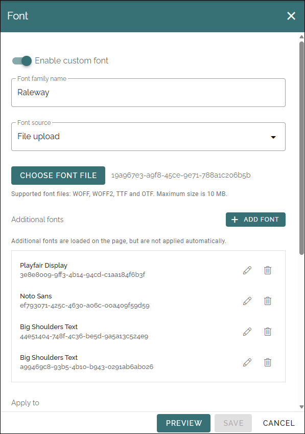
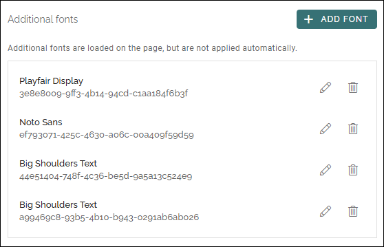
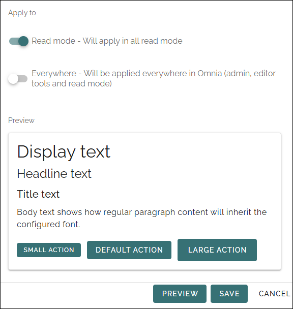

Fonts - Tenant
================================

Here you can add a custom fonts, to be used for different text styles. Available in Omnia 7.12 and later. 

**This documentation is preliminary. Will be updated soon.**

In the first step, you select one custom font. Also see "Apply to" below.

+ **Enable custom font**: If you would like to use a custom font in Omnia, the first step is to activate this option.
+ **Font family name**: (A description will be added soon).
+ **Font source**: The source can be file upload, a CDN file link or a browser font. "Browser font" uses a font already available in the browser. Just enter the font family name above, no file or link is needed.
+ **CHOOSE FONT FILE**: If you have chosen to upload a font file, click this button and find the file. Supported font files: WOFF, WOFF2, TTF and OTF. Maximum size is 10 MB (As noted below the button).
+ **CDN Font file URL**: For a CDN font, add the link here.

Additional fonts
*******************
You can also add additional fonts, that are loaded on the page, but are not applied automatically.

Click the button and upload a font file (WOFF, WOFF2, TTF and OTF. Maximum size is 10 MB), or add a link to a CDN font file (Browser fonts can not be selected here).

The selected additional fonts are listed, for example:

You can edit settings for an additional font by clicking on the pen, or use the dust bin to remove it.

Apply to
********
Here you decide where the custom font should be applied. You can also see a preview.

+ **Read mode**: Will be applied where users can read published texts.
+ **Everywhere**: As above, and also in Omnia admin and in edit tools.

