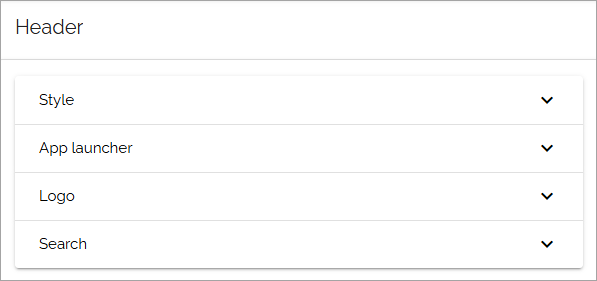
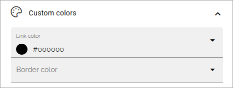

Header - Tenant settings
==============================

Here you can change the default settings for the header in the tenant. In the header settings for a workspace for a business profile, you can choose to inherit those settings or create specific settings. 

Style
*********
Set background color and text color here.

App launcher
***************
You can create the feeling that when entering Omnia the user is still in Microsoft 365, by adding the Omnia app launcher. It's fully configurable. It's placed in the same position as the app launcher in Microsoft 365. Here you can edit the settings. 

+ **Enable**: The first step is to decide to use the Omnia app launcher or not. If it's not enabled, the space is simply empty.

Note that there's a feature available for the tenant to install default app launcher links to make it really easy to get going with the Omnia app launcher. For more information, see: :doc:`Features - Tenant </admin-settings/tenant-settings/features/index>`

App launcher button
--------------------
Here you can set background color, icon color and hover color, if you're not happy with the default color settings.

General
----------
The following settings are available here:

+ **Title**: Set the title for the app launcher. This is shown as the tool tip for the button.
+ **Sorted by**: Open the list and decide how to sort the icons; Custom, Alphabetic or Last Visited. If you choose Custom, use the option "Custom" below for sorting (not shown for Alphabetical or Last visited).
+ **View template**: The icons can be viewed in a number of ways; Simple list, App icons, Navigation view or App launcher. See below for examples.
+ **Include mandatory links**: Select this option if mandatory links should be shown.
+ **Include non-mandatory links**: Select this option if non-mandatory links, in the link categories selected, should be displayed as well.
+ **Use targeting**: Targeting is set per link in the Shared links sections, one available for the tenant, and one available for the business profile. Here you can choose to use the links targeting setting, or not. Default=not selected, meaning the targeting setting for the link is not used.  
+ **Include personal links**: If the logged in user's personal links, created using My links, should be displayed in the App launcher as well, select this option. Note that one or more categories that contain personal links will have to be selected below, for any personal links to show up.
+ **Include following links**: Users can follow links in My links. If these links should be available in the App launcher as well, select this option. Note that one or more categories that contain followed links will have to be selected below, for any followed links to show up.
+ **No result text**: If you like a specific text to be shown when there's no result (nothing to show), add it here.
+ **Categories**: Select one or more categories of links to display in the App launcher. Each link is categorized when set up, either for the tenant or for the business profile. 
+ **Item Limit**: Set the number of links that should be displayed in the list, before "All apps" or similar is shown. 

Custom colors
-----------------
Here you can set custom colors for the icons, if needed:

Custom Sort
-----------
Use the arrows to decide in which order links form the various sources are shown.

Logo
************
When a logo is selected it can look like this:

+ **Text**: A text can be displayed beside the logo. If you want that, add it here. 
+ **Logo text**: This text is used as tooltip and alt text for the logo.
+ **ADD IMAGE**: Shown when no logo is added. To add an image as logo, click here and use the media picker. For information about how to use the media picker, see: :doc:`The media picker </general-assets/media-picker/index>`

When a logo is added, click the pen to edit the image, or select another image, the x to delete.

**Important note!** SVG files can not be used as a logo. The recommendation is to use PNG.

Search
********
The following settings are available here:

+ **Search box on header**: If a search box should be available in the header, select this option.
+ **Add @search parameter to the query string**: Available when the option above is selected. For advanced search implementations. With this option active you can add parameters to the search query string, for various implementations.
