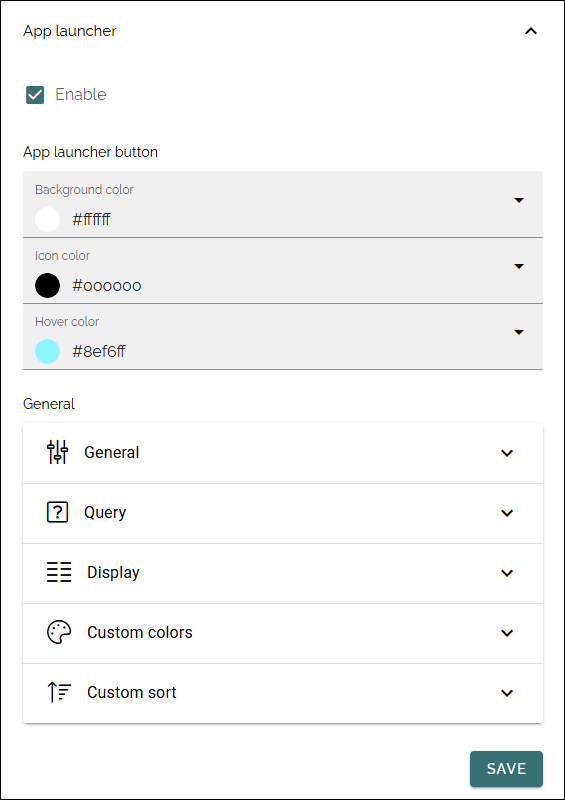

Header settings in Omnia 7.12 and later
==========================================

This page describes the App launcher settings for Header in Omnia 7.12 and later. The rest of the Header settings are the same as in 7.11. For 7.11 and earlier, see this page: :doc:`Header settings </admin-settings/tenant-settings/settings/header/header-65/index>`

In 7.12 and later, the settings are organized this way: 

.. image:: omnia-app-launcher-v78.png

+ **Enable**: The first step is to decide to use the Omnia app launcher or not. If it's not enabled, the space is simply empty.

Note that there's a feature available for the tenant to install default app launcher links to make it really easy to get going with the Omnia app launcher. For more information, see: :doc:`Features - Tenant </admin-settings/tenant-settings/features/index>`

In 7.12 and later, the options are organized differently:

Avaiblabe options are geneally the same. More information about this will be added soon.

App launcher button
--------------------
Here you can set background color, icon color and hover color, if you're not happy with the default color settings.

General
----------
The following settings are available here:

.. image:: app-launcher-settings-general-v78.png

+ **Title**: Set the title for the app launcher. This is shown as the tool tip for the button.
+ **Sorted by**: Open the list and decide how to sort the icons; Custom, Alphabetic or Last Visited. If you choose Custom, use the option "Custom" below for sorting (not shown for Alphabetical or Last visited).
+ **View template**: The icons can be viewed in a number of ways; Simple list, App icons, Navigation view or App launcher. See below for examples.
+ **Include mandatory links**: Select this option if mandatory links should be shown.
+ **Include non-mandatory links**: Select this option if non-mandatory links, in the link categories selected, should be displayed as well.
+ **Use targeting**: Targeting is set per link in the Shared links sections, one available for the tenant, and one available for the business profile. Here you can choose to use the links targeting setting, or not. Default=not selected, meaning the targeting setting for the link is not used.  
+ **Include personal links**: If the logged in user's personal links, created using My links, should be displayed in the App launcher as well, select this option. Note that one or more categories that contain personal links will have to be selected below, for any personal links to show up.
+ **Include following links**: Users can follow links in My links. If these links should be available in the App launcher as well, select this option. Note that one or more categories that contain followed links will have to be selected below, for any followed links to show up.
+ **No result text**: If you like a specific text to be shown when there's no result (nothing to show), add it here.
+ **Categories**: Select one or more categories of links to display in the App launcher. Each link is categorized when set up, either for the tenant or for the business profile. 
+ **Item Limit**: Set the number of links that should be displayed in the list, before "All apps" or similar is shown. 

Custom colors
-----------------
Here you can set custom colors for the icons, if needed:

.. image:: app-launcher-settings-custom-colors-v78.png

Custom Sort
-----------
Use the arrows to decide in which order links form the various sources are shown.

.. image:: header-custom-sort-v78.png

