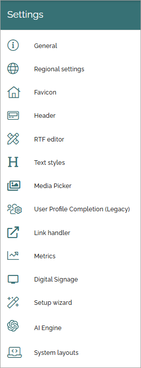

Settings
====================

Here you can set the following in Omnia 7.7 (see below for 7.8):

.. image:: tenant-settings-v7.png

Select section for more information:

.. toctree::
   :titlesonly:

   digital-signage-613/index
   favicon-tenant/index
   general/index
   header/header-65/index
   link-handler/index
   media-picker/index
   metrics/index
   open-ai/index
   regional-settings/index
   rtf-editor/index
   setup-wizard/index
   system-layouts/index
   text-styles/index
   user-profile-completion/index
   

In Omnia 7.8, the menu looks like this:

For descriptions of the AI engine functionality, see:

(Link to bed added)
