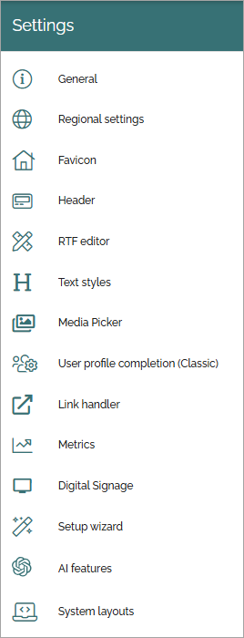

Settings
====================

Here you can set the following in Omnia 7.8 and later (see below for a comment about Omnia 7.7):

Select section for more information:

.. toctree::
   :titlesonly:

   ai-engine/index
   digital-signage-613/index
   favicon-tenant/index
   general/index
   header/header-65/index
   link-handler/index
   media-picker/index
   metrics/index
   regional-settings/index
   rtf-editor/index
   setup-wizard/index
   system-layouts/index
   text-styles/index
   user-profile-completion/index
   

In Omnia 7.8 and later, the Open AI option has been renamed AI features, and contains additional functionality (Semantic search). For the Omnia 7.7 functionality (Open AI), see:

:doc:`Open AI </admin-settings/tenant-settings/settings/open-ai/index>`
