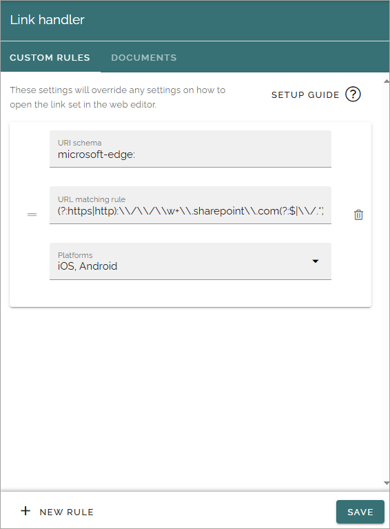
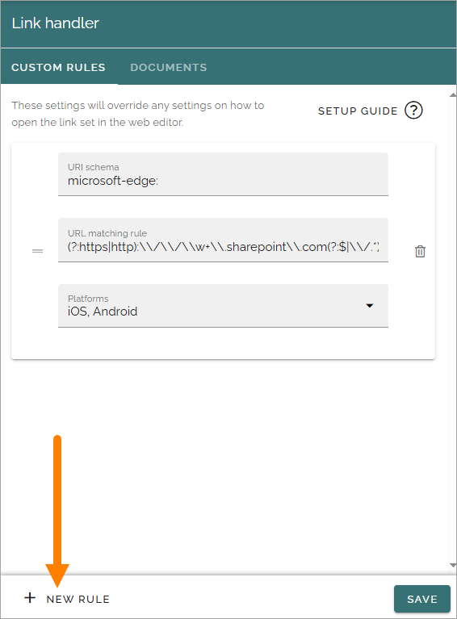
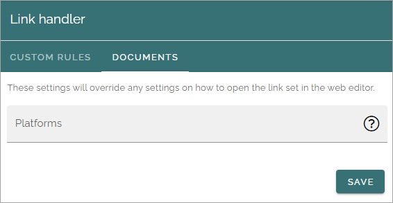

Link handler
===============================

Prerequisite: the tenant feature "Link handler" must be activated.

The following settings are available here:

You use the CUSTOM RULES tab to set up general rules for how links should be handled. A description of how to use the fields are found by clicking SETUP GUIDE.

To set up additional rules, click here:

The fields are the same as you see above, only now empty. Remember, a description can be found by clicking SETUP GUIDE on the CUSTOM RULES tab.

Documents
************
The following field is available on this tab:

Here you set up rules for documents especially. This is separate from the settings on the CUSTOM RULES tab. 

