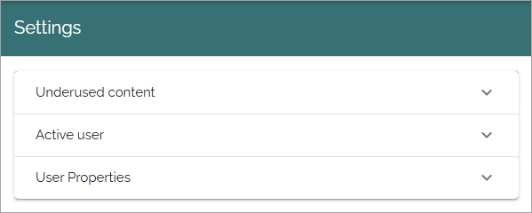
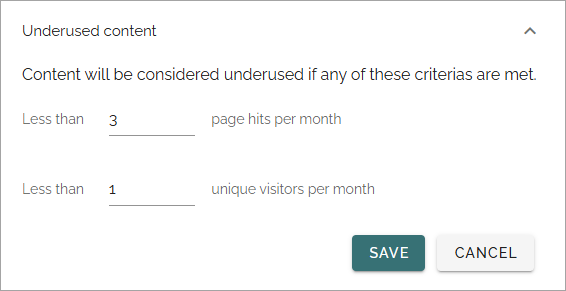
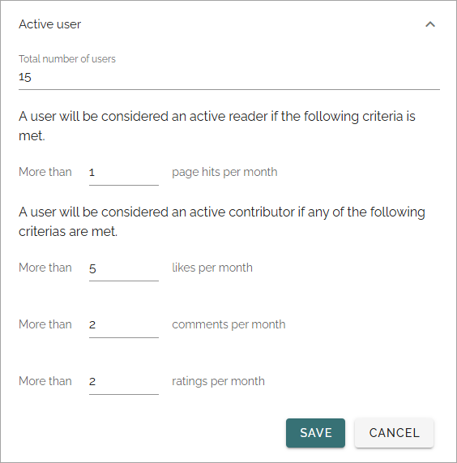
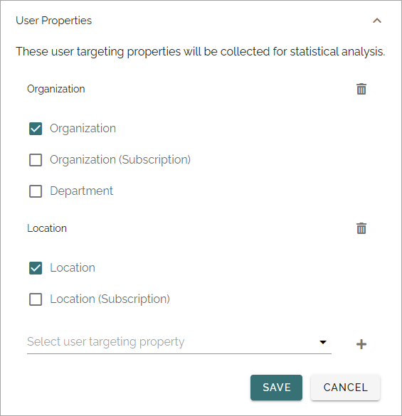

Metrics settings
=================

Here you can edit the settings for some metrics:

Underused content
*******************
The following settings are available for what will be considered underused:

Don't forget to save if you have made any changes.

Active user
*********************
Here you can edit settings for what is to be considered as an active reader or an active contributor:

+ **Total number of users**: Active readers or Active contributors can either be shown as a number of users, or as a percentage. If you would like it to be shown as a percentage, you must add the total number of users here. (Omnia has no way of knowing the total, potential users of the solution).

Don't forget to save if you have made any changes.

User properties
******************
Here you can add properties to be collected for statistic analysis. The properties must be set up as Targeting properties to be available here.

1. Open the list "Select user targeting property" and select a property.
2. Click the plus to add it to the list.
3. Continue this way until all chosen properties are added.

To remove a property from the list, click the dust bin.

Don't forget to save of you have made any changes.

