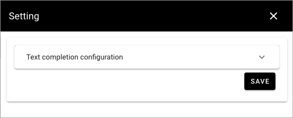
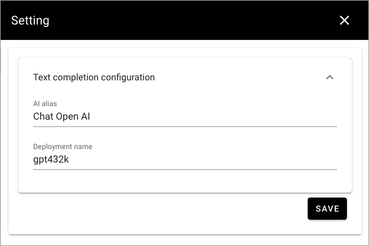

Settings (OpenAI)
=============================================

This description applies to Omnia 7.7. For the AI settings in Omni 7.8 and later, see: :doc:`Model configuration (AI) </admin-settings/tenant-settings/settings/ai-engine/settings-ai-engine/index>`

The following settings are available here:

Text completion configuration
*******************************
The following options are availble here:

+ **AI alias**: Add the label to be used in the UI here.
+ **Deployment name**: Add the name for the deployment you are using. 

