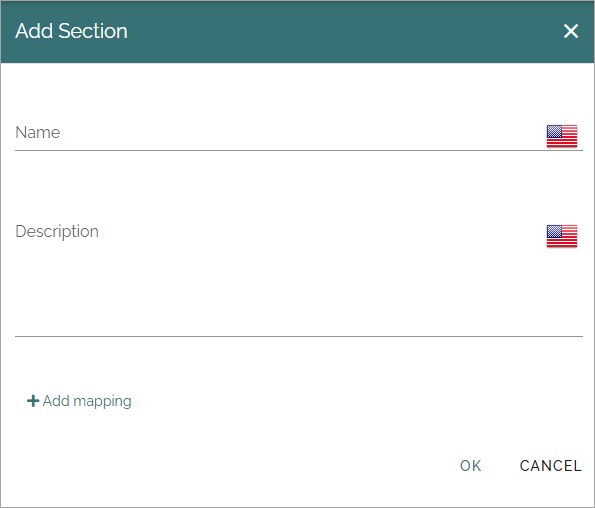

User profile completion (Classic)
==================================

This is the settings for the user option "Strengthen profile", that can be available as an action or as a block. Another option is to set that a dialog should appear with certain intervals, see below.

Note that a different approach for handling user profile information is available as an alternative in Omnia 7.7 and later. If allowed in the tenant, users can edit their profile information directly on the user profile card. Custom profile cards can also be created. For more information, see the heading "User profile completion" on this page: :doc:`User types </admin-settings/tenant-settings/user-management/user-types/index>`

The settings
**************

The following settings are available:

General
--------
Here you can set these settings:

(All options are not shown in the image.)

+ **Show dialog**: Decide how often the Dialog should be shown for a user. First set "Daily", "Weekly" or "Monthly" and then set details if needed. The dialog appears on all Omnia pages when a user starts the intranet and remains open until the users closes the dialog.
+ **Start date**: Click in the field and use the calendar to select start date for the Dialog's first appearance.
+ **No end date/End by**: Select when the Dialog should no more be shown; never ("No end date") or click in the "End by" field and use the calendar to set a date.
+ **Title**: Use this field to enter a Title for the Dialog. Click the list icon to add Titles in any available language.
+ **Description**: Enter a description, or rather information about what the user should do, in this field. Click the list icon to add Descriptions in any available language.
+ **Feeback Email**: Add the Email address that feedback from user profile completion should be sent to.
+ **Levels**: Use these color settings to set what color to display for different levels of completion. 

Property mappings
------------------
Use these settings to map user input to certain properties.

To edit a property mapping, click the heading. The same settings as for a new profile property can be used, see below. To delete a profile property, click the dust bin.

Create a new property mapping
------------------------------
Here's how to create a new property mapping:

1. Click "Add section".
2. Add names and descriptions.

3. Click "Add mapping".

Use the following settings:

Different options are shown depending on type selected, example with "SharePoint user profile" selected.

+ **Source type**: Select "SharePoint User Profile" or "Omnia System Language". For "Omnia System Language" only the property text is available.
+ **Type**: Open the list and select type of property.
+ **Label**: Add a label for the property in any available language.
+ **Property**: Select property in the list. Available for alla types except Profile picture.
+ **Completeness impact**: Select the impact of completeness status: None, High, Medium or Low. Think how important it is that this property is filled in by the user.
+ **Multiple**: Available for the type "Term Set" only. Check the box to make it possible for the user to select more than one term for the property.
+ **Read-only**: Select this option for properties that should be shown to the user, but can't be edited by the user. 
+ **Allow feedback**: To make it possible for users to send feedback for this property, check the box.
+ **Custom target**: Available for the type "Profile Picture" only. Select this option to add an URL to get image from. For more information, see below.

**Tip!** If you allow feedback for a Read-only property, the user can still send feedback about the information shown in the field.

Mapping profile images
-------------------------------------------------
If profile images are managed in another system (or in the SharePoint My site, which is likely the case in an on-prem installation), you can use these options to map to that system, this way:

1. Create a profile image mapping, and then select "Add mapping".
2. Select "SharePoint user profile".
3. Select "Profile picture" for "Type".
4. Select "Custom target".
5. Add the custom target URL.
6. Add additional settings as needed.
7. Click OK.

