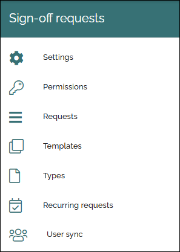

Sign-off requests
====================================

Sign-off requests can be used for read receipts for pages, including news. Available for Omnia pages and (in Omnia 7.12 and later) SharePoint pages. Sign-off requests for controlled documents can also be available.

Pre requisites:

+ For any sign-off functionality to be avaiable, the tenant feature "Sign-off request" must be active.
+ For sign-off for controlled documents to be available, the tenant feature "Sign-off request for published document" be active.

The following settings are available here (image from Omnia 7.12):

Select section for more information:

.. toctree::
   :titlesonly:

   sign-off-settings-613/index
   sign-off-permissions-613/index
   sign-off-request-requests-613/index
   sign-off-templates-613/index   
   sign-off-types-613/index
   recurring-requests/index
   user-sync-sign-off-requests/index

A rollup block for sign-off requests, useful both for making sign-off requests available and for keeping track of status for the requests, is also be available: :doc:`Sign-off requests block </blocks/sign-off-requests-rollup-613/index>`

