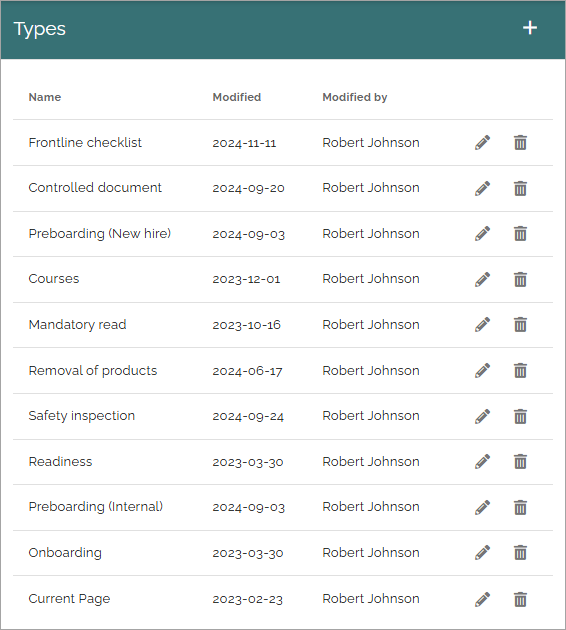
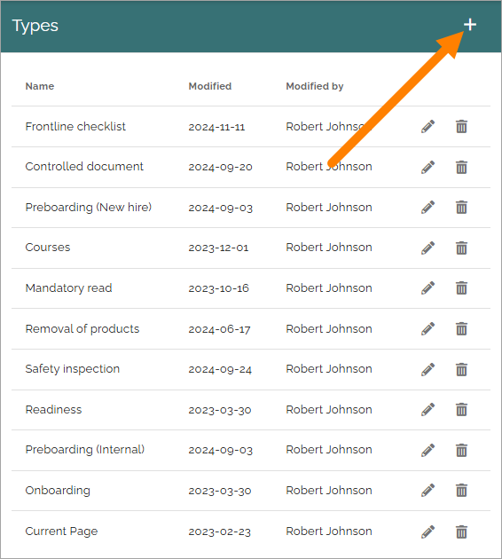
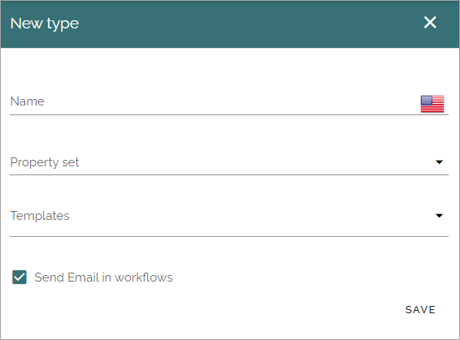

Types
=============================================

Use this option to create, edit or remove types used for sign-off requests. A type is used to decide the property set available when creating a request. 

It works a bit differently depending on if one or several types are cretaed here. If just one type is created, it's used for all requests and there's simply no way to choose type when a request is created. If more than one type is created, it's mandatory to select type for the request.

If you have created any, they will be listed here:

When editing a type (the pen) all settings can be changed, see below. And as usual, click the dust bin tp delete a type that is no longer needed. A type that is curently used in a request can not be deleted.

Create a new type
*********************
Do the following to create a new type:

1. Click the plus.

2. Use the following settings:

+ **Name**: Add a name in any tenant language.
+ **Property set**: Select property set to be used for this type. You can find information on how property sets work here: :doc:`Property sets </admin-settings/tenant-settings/properties/property-sets/index>`.
+ **Templates**: Select one or more templates for this type. If more than one template is selected, the user creating the request can select template to use for that particular request.
+ **Send Email in workflows**: If sign-off requests should be sent as Emails, keep this option selected. If deselected, no Emails will be sent at all regarding sign-off requests. 

3. Save when you're done.

