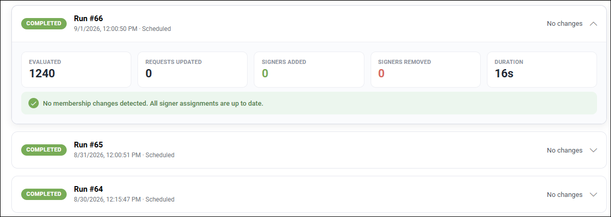

User sync - sign-off requests
==============================

Avaialable in Omnia 7.12 and later.

(**This is a preliminary documentation off the new functionality. Will be updated soon**.)

In Omnia 7.12 long-running requests sent to a group are treated differently. (Omnia groups are not supported). These sign-off requests now stay in sync with group membership, meaning they stay in sync with current group memebership so the correct people receive the memo, even new group members.

+ New group members are added to the existing request if they are not already assigned when sync runs.

+ Users who leave the group are removed or made inactive only if they have not signed off when sync runs.

+ Users who already signed off stay on the request with their completion status unchanged when sync runs.

+ The sync updates the existing request instead of creating a new one.

+ The system records what changed in each sync run and add it in a user sync log.

+ If nothing changed in the group, the request stays unchanged unless there are changes made to the request itself.

**Important note**: Omnia groups are not suppported (all other types of groups are).

In this list you can see the update logs, so you can recipient changes and have a clear starting point in troubleshooting problems.

