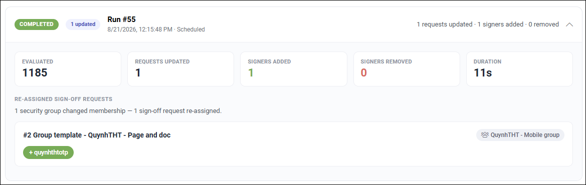

User sync - sign-off requests
==============================

Avaialable in Omnia 7.12 and later.

Long-running requests sent to a group are treated differently than before. These sign-off requests now stay in sync with current group membership, meaning the correct people will always receive the request, even new group members.

+ New group members are added to the existing request if they are not already assigned when the sync runs.

+ Users who leave the group are removed or made inactive only if they have not signed off when sync runs.

+ Users who already signed off stay on the request, even if they have left the group, with their completion status unchanged when sync runs.

+ The sync updates the existing request instead of creating a new one.

+ The system records what has changed in each sync run and add it in the user sync log (see example below).

+ If nothing changed in the group, the request stays unchanged unless there are changes made to the request itself.

**Important note**: Omnia groups are not suppported for this sync (all other types of groups are).

In the list you can see the update logs, so you can note recipient changes and have a clear starting point when troubleshooting problems.

If there are any changes to a request, it can be noted this way (image from a test environment):

