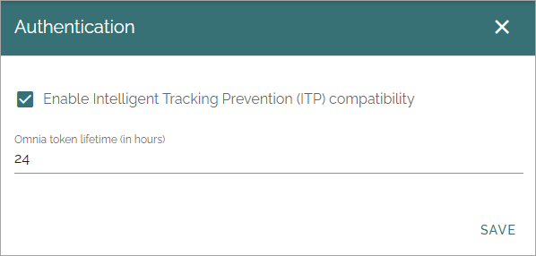

Authentication
==================

The following can be enabled here:

+ **Enable Intelligent Tracking Prevention (ITP) compatibility**: If Safari users in your organization has the Intelligent Tracking Prevention activated, this option has to be enabled in Omnia. **Note!** This option is not available in Omnia OnPrem.
+ **Omnia token lifetime (in hours)**: Here you can set the Omnia token lifetime.

