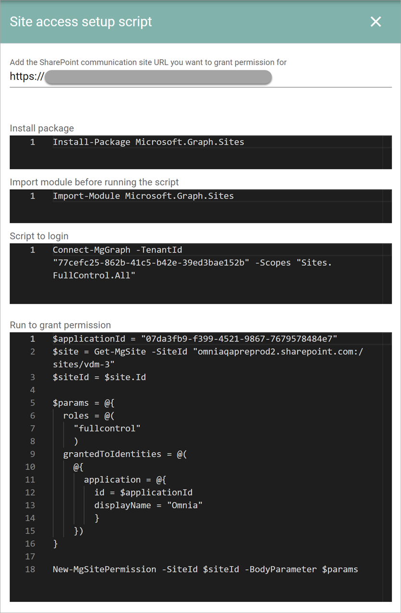

Site access setup script
=====================================

Available in Omnia 7.11 and later.

Use this setting for a single site collection setup.

Add the URL to the main communcation site. When you do, the scripts needed will be shown and you can copy them from there:

Some additional information about single site collection and how it works in Omnia, can be found here: :doc:`Single site collection </general-assets/single-site-collection/index>`

There is also a lot of information on Microsoft's pages, that can be useful. The pages are easy to find through search.

